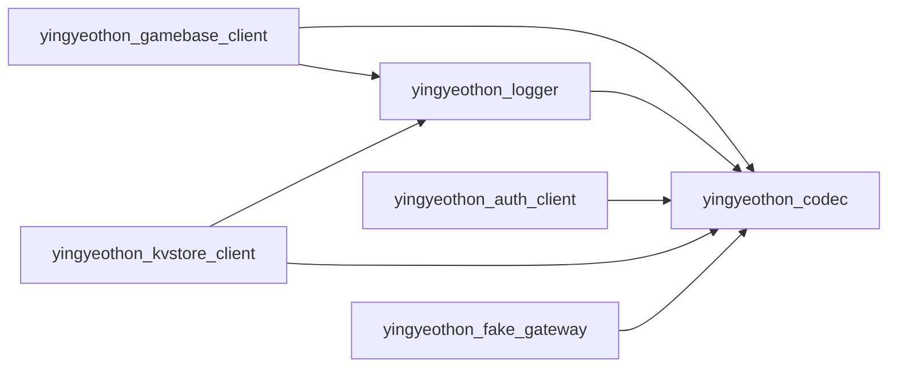

# flutterlib

The Dart client libraries for the **yyt platform**: point them at the channels you
provisioned in the [yyt console](https://console.yyt.life/ui/) and a Flutter game is
talking to the realtime gateway — positions, chat, parties, and a dungeon run against
your own game actor — with the sign-in flow that gets it a token and a key-value
store for announcements and each player's own record.

Pure Dart, no Flutter import, so the same packages run on Android, iOS, desktop and
web, and `dart test` covers them without a device.

```dart
import 'package:yingyeothon_gamebase_client/yingyeothon_gamebase_client.dart';

final lobby = GatewayLobbyClient(GatewayLobbyClientOptions(
  url: 'wss://gw.yyt.life',            // the channel's wsUrl, origin only
  channelId: 'lobby_0123456789abcdef', // from the console
  token: channelJwt,                   // from your auth channel
));

final hello = await lobby.connect();   // completes on the gateway's hello
lobby.peerEntered.listen((peer) => print('${peer.userId} is here'));
lobby.pos(zone: hello.zone, x: 1, y: 2, dir: 'n');
```

## Documentation

**[Start here](docs/README.md)** — the guide is written to be enough on its own.

| | |
| --- | --- |
| [Getting started](docs/getting-started.md) | empty Flutter project to a connected, moving client |
| [Console and options](docs/console-and-options.md) | what the console hands you, and every option |
| [Authentication](docs/authentication.md) | how a client gets its channel JWT |
| [Lobby](docs/lobby.md) / [Dungeon](docs/dungeon.md) | the two channel kinds, feature by feature |
| [Key-value store](docs/kvstore.md) | announcements and a player's own record, with the same token |
| [Connection lifecycle](docs/connection-lifecycle.md) | states, events, reconnect, backoff |
| [Errors](docs/errors.md) / [Troubleshooting](docs/troubleshooting.md) | every refusal, close code and symptom |
| [Flutter](docs/flutter.md) | platforms, background, debug hooks, desktop verification |
| [Examples](examples/README.md) | the playground app: offline demo, no credential needed |

## Packages

| Package | Description |
| --- | --- |
| [yingyeothon_codec](packages/yingyeothon_codec) | Bounded JSON decode and encode: length and depth caps, non-throwing core, failures that never quote the input |
| [yingyeothon_logger](packages/yingyeothon_logger) | Structured logger with a live severity threshold |
| [yingyeothon_event_broker](packages/yingyeothon_event_broker) | Type-keyed asynchronous event broker |
| [yingyeothon_gamebase_client](packages/yingyeothon_gamebase_client) | Client SDK for the yyt realtime gateway (lobby + dungeon `q`) |
| [yingyeothon_auth_client](packages/yingyeothon_auth_client) | The client half of the auth channel: config, sign-in URL, redirect, exchange, verify |
| [yingyeothon_kvstore_client](packages/yingyeothon_kvstore_client) | Client for the yyt key-value store: collections by name, `me` namespace, versions, TTL, `incr` |
| [yingyeothon_fake_gateway](packages/yingyeothon_fake_gateway) | In-process gateway for tests and the offline demo; never published |

The arrows are the `dependencies:` each pubspec declares; `event_broker` stands alone.



`logger -> codec` is an edge tslib does not have: a structured log context is a
`JsonObject` so a writer renders it the same way on every platform.

## Ported from tslib and csharplib

These are Dart reimplementations of the [tslib](https://github.com/yingyeothon/tslib)
packages a game client can use, following the fixes
[csharplib](https://github.com/yingyeothon/csharplib) made on the way to Unity. tslib
has twenty packages; the rest are AWS Lambda, Redis or Node-socket server code that
cannot run on a phone. Two things are new here: `yingyeothon_auth_client`, because a
Flutter app signs in through a browser redirect and the parsing is easy to get
wrong, and `yingyeothon_fake_gateway`, so the SDK is tested end to end and the example
runs with no credential. `yingyeothon_kvstore_client` is the Dart port of tslib's
`kvstore-client`, with the same shape in all three languages.

## Install

Until a release is tagged, depend on `main` by git; append `ref: <tag>` to pin one.
A package's siblings are relative path dependencies inside the same checkout, so one
git dependency per package you use is enough:

```yaml
dependencies:
  yingyeothon_gamebase_client:
    git:
      url: https://github.com/yingyeothon/flutterlib.git
      path: packages/yingyeothon_gamebase_client
  yingyeothon_auth_client:
    git:
      url: https://github.com/yingyeothon/flutterlib.git
      path: packages/yingyeothon_auth_client
  yingyeothon_kvstore_client:
    git:
      url: https://github.com/yingyeothon/flutterlib.git
      path: packages/yingyeothon_kvstore_client
```

**No release has been tagged yet**, so these track `main`. Nothing is on pub.dev.

## Development

Requires the Dart SDK 3.13+ (bundled with Flutter 3.47+). Flutter is needed only for
the example.

```bash
tool/bootstrap.sh    # pub get, git hooks, tool check — once after cloning
tool/gate.sh         # format, analyze, test, coverage floor, docs gate, example
```

This repository is public, so the hooks refuse a commit that carries tool output, a
platform folder, or anything credential-shaped, and run [gitleaks][] on the staged
diff — install it, or every commit is refused. CI runs the same scan over the whole
history. See [rules/security.md](rules/security.md).

[gitleaks]: https://github.com/gitleaks/gitleaks

API design rules are in [CONVENTIONS.md](CONVENTIONS.md); durable lessons are in
[rules/](rules/index.md).

## License

MIT — see [LICENSE](LICENSE).
