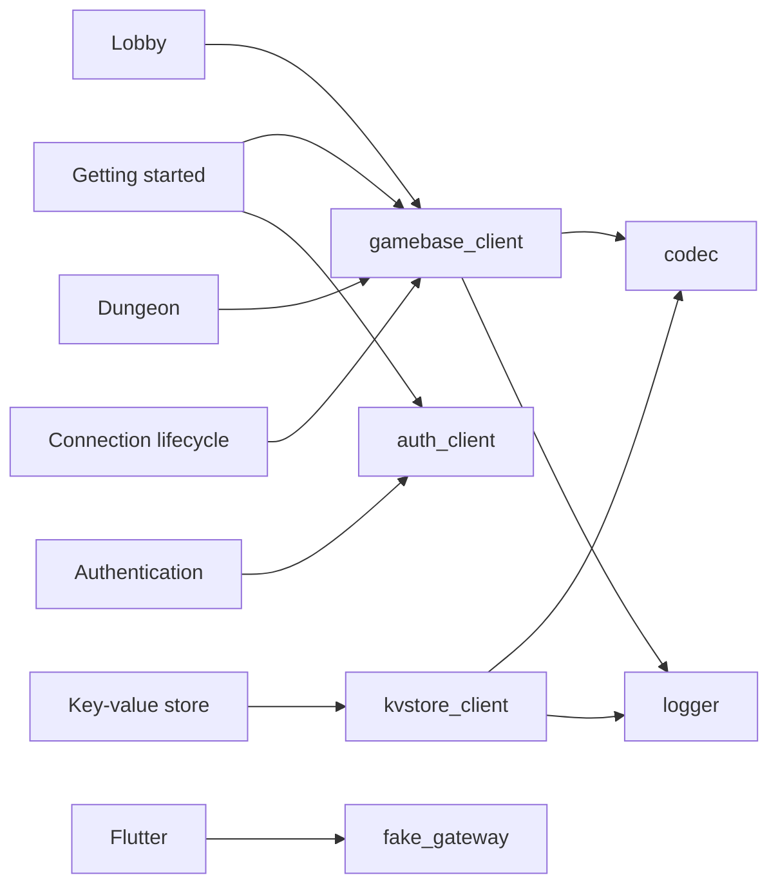

# The guide

Everything a Flutter developer needs to put a game on the yyt gateway with these
packages. Each page is one task; read the first three in order, then jump.

## Start here

1. [Getting started](getting-started.md) — an empty Flutter project to a connected,
   moving client, on Linux desktop first.
2. [Console and options](console-and-options.md) — the values the console hands you,
   and every option the clients take.
3. [Authentication](authentication.md) — how the client gets its channel JWT, and why
   it never reads it back.

## By what you are building

| You want to | Read |
| --- | --- |
| show players moving around a shared zone, chat, parties | [Lobby](lobby.md) |
| run a dungeon against your own game actor | [Dungeon](dungeon.md) |
| read announcements, save a player's own record | [Key-value store](kvstore.md) |
| know what happens on a bad network, a gateway restart, a dead token | [Connection lifecycle](connection-lifecycle.md) |
| handle every refusal, close code and exception | [Errors](errors.md) |
| ship on web, keep the socket alive across background, verify on desktop | [Flutter](flutter.md) |
| find out why it does not connect | [Troubleshooting](troubleshooting.md) |

Which page draws on which package:

<!-- check-docs: exhaustive -->

## Reference

- Package READMEs, each with its full `## Public API`:
  [gamebase_client](../packages/yingyeothon_gamebase_client/README.md),
  [auth_client](../packages/yingyeothon_auth_client/README.md),
  [kvstore_client](../packages/yingyeothon_kvstore_client/README.md),
  [codec](../packages/yingyeothon_codec/README.md),
  [logger](../packages/yingyeothon_logger/README.md),
  [event_broker](../packages/yingyeothon_event_broker/README.md),
  [fake_gateway](../packages/yingyeothon_fake_gateway/README.md).
- [Examples](../examples/README.md) — the playground app.

## What lives in the `service` repository

The gateway's wire protocol, the auth service's endpoints, the key-value store and the
console are owned by
[yingyeothon/service](https://github.com/yingyeothon/service). This guide cites them;
when the two disagree, `service` is right and this SDK follows.
