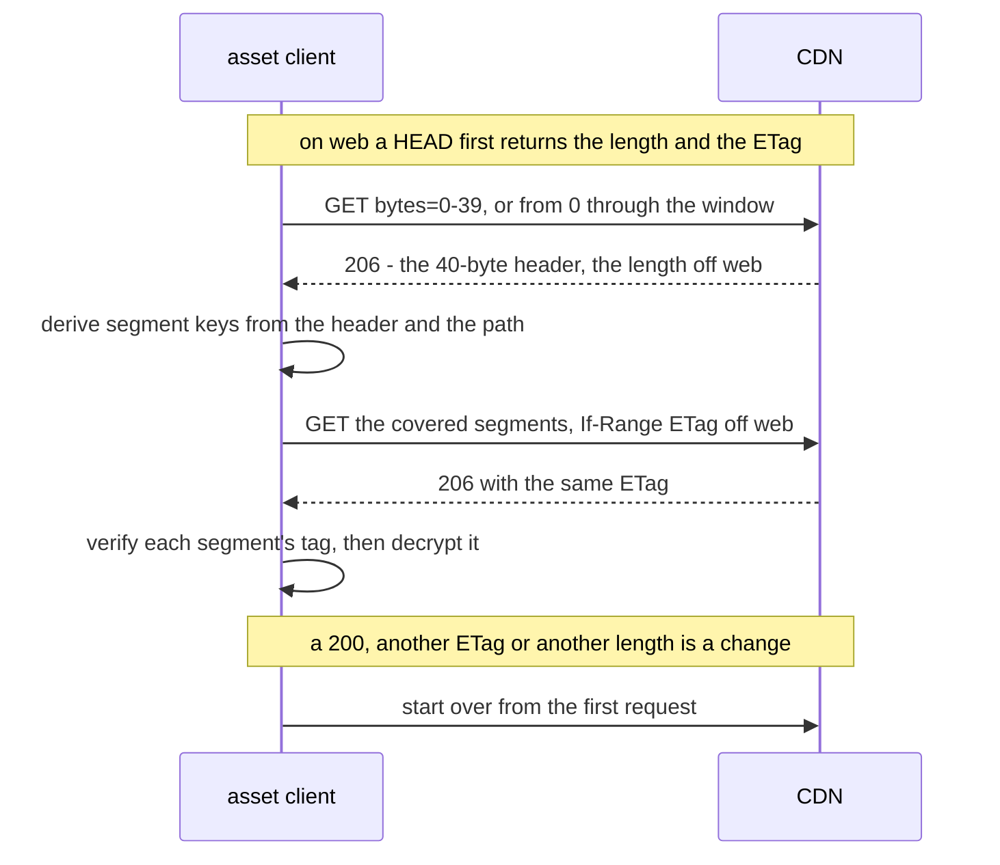

# Asset bundles

Files a game ships beside its code without shipping them in its build: a SQLite
database, music, a level pack, and the manifest that names them. This page owns how a
game lays out and reads a bundle with `yingyeothon_asset_client`; creating bundles,
`yyt asset sync`, the key and the CDN's cache rules belong to the
[`service`](https://github.com/yingyeothon/service) repository (`docs/decisions.md`
_Live and encrypted asset bundles_ and `docs/asset-encryption.md` there), which is
right when this page disagrees.

**Reference:** the [package README](../packages/yingyeothon_asset_client/README.md)
carries the options, the request count of every call, the browser rules, the resume
rules and every error code. The playground's **Asset bundle** screen reads an encrypted
bundle from its offline demo ([examples/playground](../examples/playground/README.md)).

## Bundle shapes

A bundle is created once, with `yyt asset create <name> --mode live` (or `versioned`,
the default) and optionally `--encrypted`. Neither choice can be changed later, and
together they decide how a game reads the bundle.

| Choice | Values | What the client does with it |
| --- | --- | --- |
| `mode` | `versioned`, `live` | `baseUrl` ends in `/{bundleId}/{version}/` or in `/{bundleId}/`; your build picks the version to read |
| `encrypted` | off, on (a `yak1.` key) | without `key` the client returns the bytes as served; with it, it verifies and decrypts them, same calls |

`yyt asset files <bundle>` prints each file's public URL, which is where the bundle id
and the CDN host of `baseUrl` come from, and `yyt asset key show <bundle>` prints an
encrypted bundle's key.

**The key is inside every copy of your app.** Encryption keeps the bundle from someone
who finds a CDN URL, which a plain bundle never did; it does not keep it from your
players, and a leaked key means a new bundle and an app release. Pass it to the client
from your build (`--dart-define`, a generated file) rather than committing it.

## The manifest pattern

Inside a live bundle each file is immutable (served for a year; its path only ever
accepts the same bytes again) or mutable (served `no-cache`, 256 KiB at most by
default, meant for a manifest). The usual layout is one mutable manifest naming
immutable files by content, uploaded with `yyt asset sync <bundle> <dir> --mutable
manifest.json`. A release then replaces the manifest and nothing else, and no CDN
invalidation is ever needed:

```dart
// On web import yingyeothon_asset_client.dart instead; the io library adds
// downloadToFile and re-exports the rest.
import 'package:yingyeothon_asset_client/yingyeothon_asset_client_io.dart';

// An unset define would be '' — not a key, so bad_key — hence the check.
const bundleKey = bool.hasEnvironment('BUNDLE_KEY')
    ? String.fromEnvironment('BUNDLE_KEY')
    : null; // a plain bundle

final bundle = AssetBundleClient(AssetBundleClientOptions(
  // dev: https://dev-d.yyt.life/assets/ab_…/
  baseUrl: 'https://d.yyt.life/assets/ab_0123456789abcdef/',
  key: bundleKey,
));

// the manifest revalidates on every read; the files it names never change
final manifest = await bundle.readJson('manifest.json') as Map<String, Object?>;
final db = await bundle.read(manifest['db']! as String); // e.g. 'data/songs-3f9a.db'
```

`sync` uploads the immutable files before the manifest, so a manifest never names a
file that is not there yet.

## A large file on a phone

A file of tens of megabytes should go to disk, not memory, and survive the app being
killed halfway. `downloadToFile` (not on web) resumes from where an earlier call
stopped and puts the file in place only once every segment verified — its doc comment
says how:

```dart
// path_provider is the app's dependency, not this package's.
final dir = await getApplicationCacheDirectory(); // re-downloadable: no backup
final name = manifest['music']! as String;        // immutable: named by content
// A flat local name: the manifest chose `name`, so never let it pick a folder.
final file = File('${dir.path}/${name.replaceAll('/', '_')}');
if (!file.existsSync()) {
  await downloadToFile(bundle, name, file.path, onProgress: (p) {
    if (!mounted) return;                          // the widget may be gone
    setState(() => progress = p.total == null ? null : p.written / p.total!);
  });
}
```

Name the file by its content (the manifest's immutable path) and an existing file is
already the right one; the cache directory may be purged, which only costs a new
download. **The file is decrypted on disk**, so it belongs in the app's own storage.
Run one download per destination at a time, and delete `<file>.part` and
`<file>.part.etag` to give up on one — `discardOnLocalFailure`, below, does that
for you after a full disk. The per-file cap is
2 MiB by default; a larger file needs the bundle's limit raised by a platform admin
first.

## Checking a file against the manifest

The CDN's ETag and length only say which object arrived, not that it is the one your
release meant. Put each file's plaintext size and SHA-256 in the manifest, computed
from the source file before `yyt asset sync` (for an encrypted bundle, the digest of
what you uploaded, not of the ciphertext the CDN serves). `downloadToFile` then checks
them, runs your own check of the finished file and only then renames it into place:

```dart
final entry = manifest['songs']! as Map<String, Object?>; // {file, size, sha256}
final name = entry['file']! as String;
final file = File('${dir.path}/${name.replaceAll('/', '_')}');
final stop = Completer<void>(); // complete it from the UI to stop the download

try {
  await downloadToFile(
    bundle, name, file.path,
    expectedSize: entry['size']! as int,
    expectedSha256: entry['sha256']! as String,
    // Open the part read-only, close it, and answer: false means "not usable".
    validate: (part) async {
      try {
        return await songsDb.looksValid(part);
      } on SongsDbException {
        return false; // a throw would keep the part and check it again next time
      }
    },
    discardOnLocalFailure: true, // a full disk gets its space back
    cancel: stop.future,
  );
} on AssetClientException catch (e) {
  switch (e.code) {
    case AssetClientErrorCode.cancelled:
      break; // the user stopped it; the next call resumes
    case AssetClientErrorCode.assetRejected:
      markBroken(name); // the bytes matched the manifest, your check did not
    case AssetClientErrorCode.sizeMismatch:
    case AssetClientErrorCode.digestMismatch:
      retryOnceThenMarkBroken(name); // local damage, or the manifest names another file
    case AssetClientErrorCode.assetCorrupt:
    case AssetClientErrorCode.badKey:
      markBroken(name); // the wrong key, path or bundle: a retry fails the same way
    default:
      retryLater(name); // network, http, not_found: the part stays to resume
  }
} on FileSystemException {
  reportStorageError(name); // a full disk, a permission, a rename the OS refused
} on Object {
  // Anything else — what validate or onProgress threw, a closed bundle client
  // (StateError), a manifest path the client refuses (ArgumentError) — is still
  // one file's failure: keep the loop over the others going.
  retryLater(name);
}
```

A part that already has the full size — the app died between the last byte and the
rename — is hashed and finished without going to the network. A file that fails the
size, the digest or your check never replaces the one already there, and its partial
download is deleted; a cancellation or a dropped connection keeps it for the next
call. Cancelling through `cancel` ends only that download: a shared bundle client and
its other reads carry on, so there is no need for a client per download.

What stays yours to do: skip a file that is already there and valid; close your own
handles on the destination before a call (a rename over an open file fails on
Windows); run one call per destination at a time; delete `.part` and `.part.etag`
of files the manifest no longer names, and anything your check leaves beside the part
(a SQLite `-journal` or `-wal`). A complete download your app saved under another
name finishes offline once renamed to `<file>.part`, given the size and the digest.

The checks are as trustworthy as the manifest. One read from the same plain bundle
catches a release that mixed up versions and local damage; it does not stand against
a CDN that serves an altered file with a matching manifest. Ship the digests in the
app, or use an encrypted bundle, when that matters.

## A ranged read, and what happens when the file changes

`read` is one `GET` of the whole file. `readRange`, and any `download` of an encrypted
file, cannot trust one answer to describe the object the next answer comes from,
because a mutable file can be replaced between them. So the client records the
object's identity first and checks every later answer against it:



A window that starts in the first segment folds the header and the segments into one
request. The segment keys depend on the path, which is why a file served under
another path fails its first tag rather than decrypting to garbage. Starting over is
bounded; the package README gives the count and the error after it.

## Errors

Everything the CDN, the network or the ciphertext refuses is an
`AssetClientException`; the [package README](../packages/yingyeothon_asset_client/README.md#errors)
has the full table. What usually causes each code:

| `code` | Why you would hit this |
| --- | --- |
| `bad_key` | the key was pasted with a character missing or added, it is some other secret, or a `--dart-define` was not set and an empty string was passed |
| `not_found` | a typo in the path or the bundle id, a file not synced yet, or a version that does not exist — the CDN says `403` |
| `asset_corrupt` | the wrong key or none for an encrypted bundle (then `readJson` sees ciphertext), a `baseUrl` naming another version or a folder, a file `yyt asset sync` did not upload, or a manifest that is not JSON |
| `http` | a proxy that ignores `Range`, a server error, or a file replaced on every attempt of one read |
| `network` | offline, a connection that went quiet or dropped mid-body; a download resumes from what it already wrote |
| `cancelled` | the `cancel` future you passed to a download completed |
| `size_mismatch`, `digest_mismatch` | the manifest names another file than the one uploaded, or a local partial file was damaged; the next call downloads afresh |
| `asset_rejected` | your `validate` returned `false` for a file whose bytes matched the manifest: the release itself is broken |

`asset_corrupt` is not worth retrying — the bytes will verify the same way the next
time — except on a host that sends no ETag, where a file replaced mid-read looks the
same. Check the key and the `baseUrl` first.

Next: the [Key-value store](kvstore.md) is the other half of what a game reads from
the platform — small records that change while the game runs, rather than files that
change when you release.
