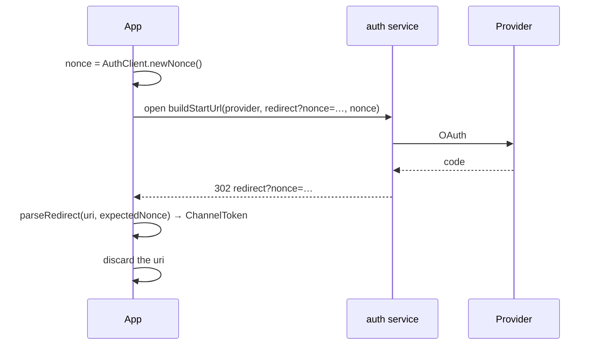

# Authentication

Every socket this SDK opens carries a **channel JWT**. This page is the client's half
of getting one; `yingyeothon_auth_client` implements it.

> The auth service belongs to the [`service`](https://github.com/yingyeothon/service)
> repository; its README specifies the endpoints and the token. If it disagrees with
> this page, it is right.

## The shape of it

Your team provisions an **auth channel** in the console. It holds an OAuth app you
registered (GitHub or Google), an `audience`, a token lifetime, and an allowlist of
URLs it will hand a token back to. A player signs in through that provider, the auth
service issues a JWT for your channel, and you put it in `GatewayClientOptions.token`.

`fetchConfig()` reads `GET /c/{authChannelId}/.well-known/config` — unauthenticated —
so the app hard-codes only a base URL and a channel id.

## The browser redirect flow

The default on a phone. The app opens a URL, the player signs in with the provider,
and the browser comes back to **your** URL with the result in the fragment:



```dart
final nonce = AuthClient.newNonce();
final start = auth.buildStartUrl(
  provider: 'github',
  redirect: Uri.parse('https://game.example/signin'),
  nonce: nonce,
);
// open `start` (url_launcher); receive `returned` (app_links, a loopback server, or
// window.location on web)
final token = auth.parseRedirect(returned, expectedNonce: nonce);
```

Two things a client must get right, and `parseRedirect` does both:

- **The nonce.** `buildStartUrl` puts it in the redirect's query; `parseRedirect`
  compares it in constant time. Without it, a link someone else constructed completes
  a sign-in in your client, as them.
- **Discard the fragment** once read. It is a credential.

`redirect` must be on the channel's allowlist — matched on origin and path prefix, so
the nonce query is admitted — or the request is refused with `403`.

## Exchanging a provider credential

One request and no browser, for a client that already has the provider's token:

```dart
final token = await auth.exchange(provider: 'github', accessToken: ghToken);
final token = await auth.exchange(provider: 'google', idToken: googleIdToken);
```

**Google requires `idToken`** and GitHub `accessToken`; the wrong one is a `400`, and
`exchange` refuses to send both.

## What the token contains

HS256, registered claims only — no PII, by design, because claims reach logs. Two
matter to a client:

- **`sub` is the identity**, and `hello.userId` echoes it. Compare avatars against what
  the gateway told you, not against the `userId` in the redirect.
- `sub` is derived from the channel, the provider and the provider's user id, so **a
  channel with two providers gives one human two identities**. Pick one provider per
  channel.

## Lifetime, expiry and reconnect

- The token lives for the channel's `tokenTtlSec` — 24 hours by default, up to 30
  days. `ChannelToken.isExpired(now)` reads `exp`.
- **There is no refresh endpoint and no revocation.** Re-authenticating means running
  the flow again.
- **Reconnect with the same token.** This SDK does; the gateway caches the verification
  until `exp`. One token serves the lobby socket, the dungeon socket and your own game
  API.
- An expired token is refused at the handshake, which a client sees only as a close
  before the socket opened — so a stale token ends in `stopped` after
  `maxHandshakeFailures` rather than retrying forever.

Storing the token is your call, and it is a credential for a day. Prefer re-running
the flow at launch over persisting it; if you persist, use the platform's secure
storage and `verify()` it at launch. Never write it to a log — this SDK never does, at
any severity, and `ChannelToken.toString()` leaves it out.

## Checking a token by hand

```dart
final still = await auth.verify(jwt); // null on 401
```

This is the fastest way to tell a bad token from a bad channel id when a connection
will not open — [Troubleshooting](troubleshooting.md) uses it as the first check.
