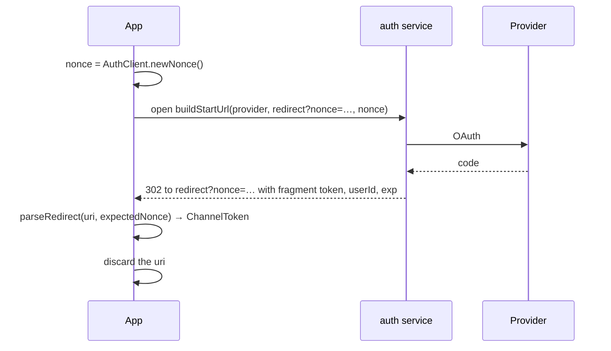

# Authentication

Every socket this SDK opens carries a **channel JWT**. This page is the client's half
of getting one; `yingyeothon_auth_client` implements it.

> The auth service belongs to the [`service`](https://github.com/yingyeothon/service)
> repository; its README specifies the endpoints and the token. If it disagrees with
> this page, it is right.

## The shape of it

Your team provisions an **auth channel** in the console. It holds an OAuth app you
registered (GitHub or Google), an `audience`, a token lifetime, and an allowlist of
URLs it will hand a token back to. A player signs in through that provider, the auth
service issues a JWT for your channel, and you put it in `GatewayClientOptions.token`.

`fetchConfig()` reads `GET /c/{authChannelId}/.well-known/config` — unauthenticated —
so the app hard-codes only a base URL and a channel id. When you register the OAuth
app, give it `callbackUrls[provider]` from that config as its callback URL.

## The browser redirect flow

The default on a phone. The app opens a URL, the player signs in with the provider,
and the browser comes back to **your** URL with the result in the fragment:


```mermaid
sequenceDiagram
  participant App
  participant Auth as auth service
  participant Provider
  App->>App: nonce = AuthClient.newNonce()
  App->>Auth: open buildStartUrl(provider, redirect?nonce=…, nonce)
  Auth->>Provider: OAuth
  Provider-->>Auth: code
  Auth-->>App: 302 to redirect?nonce=… with fragment token, userId, exp
  App->>App: parseRedirect(uri, expectedNonce) → ChannelToken
  App->>App: discard the uri
```

```dart
final nonce = AuthClient.newNonce();
final start = auth.buildStartUrl(
  provider: 'github',
  redirect: Uri.parse('https://game.example/signin'),
  nonce: nonce,
);
// open `start` (url_launcher); receive `returned` (app_links, Uri.base on web, or
// the address bar pasted back on desktop) — see "Receiving the redirect" below
final token = auth.parseRedirect(returned, expectedNonce: nonce);
```

Two things a client must get right, and `parseRedirect` does both:

- **The nonce.** `buildStartUrl` puts it in the redirect's query; `parseRedirect`
  compares it in constant time. Without it, a link someone else constructed completes
  a sign-in in your client, as them.
- **Discard the fragment** once read. It is a credential.

`redirect` must be on the channel's allowlist — matched on origin and path prefix, so
the nonce query is admitted — or the request is refused with `403`.

### Receiving the redirect

The SDK builds the URL and reads the result; **receiving the browser's return is your
app's job**, by design: it is platform glue, and each platform does it differently.
No package here will do it for you. **The token is in the fragment, and a fragment
never reaches a server** — only script in the page, or the app a link opens, sees it.

| Platform | How the URL comes back | `redirect` on the allowlist |
| --- | --- | --- |
| Android, iOS, macOS | a *verified* app link / universal link — an `https` URL your app claims (`assetlinks.json` with `autoVerify`; Associated Domains with `apple-app-site-association`) — through a package such as `app_links`: its initial link after a cold start, its stream otherwise | that URL |
| Web | the browser comes back to your page, which starts your app afresh: read `Uri.base` **before `runApp`**, then strip the fragment from the history entry | your page |
| Linux, Windows | the player copies the browser's address bar back into the app | a `localhost` path nothing serves |

A `redirect` must be `https`, or `http` only for `localhost`, `127.0.0.1` and `[::1]`,
so a custom scheme (`mygame://`) is refused; `services/auth/src/redirect.ts` in the
`service` repository has the whole rule, and the allowlist matches the exact origin,
port included. `/start` is a browser route: a refusal there is an error page in the
browser, not a status your app can read, and `/callback` refuses a sign-in finished in
another browser than the one that started it (a provider's own app intercepting the
page, say).

- **Keep the nonce across the trip.** On web the return reloads the app — open the
  start URL in the same tab (`webOnlyWindowName: '_self'`) — and a phone may kill the
  app while the browser is in front. Store the nonce before opening the URL
  (`sessionStorage` on web, the app's private storage on a phone), pass it to
  `parseRedirect`, then delete it. Only desktop copy-paste can keep it in memory, as
  the playground does.
- **On web, take the fragment before anything else sees it.** With the default hash
  URL strategy the fragment becomes the initial route name, and a `routes:` map that
  does not know it reports the route name — the token — in a debug message; a
  crash reporter or analytics SDK records `location.href`, fragment included. So read
  `Uri.base`, call `parseRedirect`, then `window.history.replaceState` (package:web)
  with the path alone, and only then initialise those and call `runApp`; or use the
  path URL strategy.
- **An app link that does not open the app opens your web page.** If verification
  failed or the player opted out, the `https` URL loads your site with the token in
  the fragment: serve a page there with no third-party script, which strips it. An
  unverified link can be offered to another app, so verify it.
- **Copy-paste leaves the URL in the browser's history** — and in any history sync —
  for up to `tokenTtlSec`, with no revocation. Whatever serves that `localhost` port
  receives the nonce and could read the fragment, so pick a path and port nothing on
  the machine serves. A loopback listener instead of copy-paste cannot read the
  fragment itself: it has to serve a page whose script reads `location.hash`, removes
  it and posts it back; bind `127.0.0.1` only, accept once, close it, and fall back to
  copy-paste if the port is taken — another process there would get the token.

Whatever receives it, pass the returned URL to `parseRedirect` — pasted text through
`Uri.tryParse`, since a `FormatException` would quote the credential — and drop it:
never log it or show it. The
[playground](../examples/playground/README.md#configure) walks the desktop path.

## Exchanging a provider credential

One request and no browser, for a client that already has the provider's token:

```dart
final github = await auth.exchange(provider: 'github', accessToken: ghToken);
final google = await auth.exchange(provider: 'google', idToken: googleIdToken);
```

**Google requires `idToken`** and GitHub `accessToken`; the wrong one is a `400`, and
`exchange` refuses to send both.

## What the token contains

HS256, registered claims only — no PII, by design, because claims reach logs. Two
matter to a client:

- **`sub` is the identity**, and `hello.userId` echoes it. Compare avatars against what
  the gateway told you, not against the `userId` in the redirect.
- `sub` is derived from the channel, the provider and the provider's user id, so **a
  channel with two providers gives one human two identities**. Pick one provider per
  channel.

## Lifetime, expiry and reconnect

- The token lives for the channel's `tokenTtlSec` — 24 hours by default, up to 30
  days. `ChannelToken.isExpired(now)` reads `exp`.
- **There is no refresh endpoint and no revocation.** Re-authenticating means running
  the flow again.
- **Reconnect with the same token.** This SDK does; the gateway caches the verification
  until `exp`. One token serves the lobby socket, the dungeon socket and your own game
  API.
- An expired token is refused at the handshake, which a client sees only as a close
  before the socket opened — so a stale token ends in `stopped` after
  `maxHandshakeFailures` rather than retrying forever.

Storing the token is your call, and it is a credential for a day. Prefer re-running
the flow at launch over persisting it; if you persist, use the platform's secure
storage and `verify()` it at launch. Never write it to a log — this SDK never does, at
any severity, and `ChannelToken.toString()` leaves it out.

## Checking a token by hand

```dart
final still = await auth.verify(jwt); // null on 401
```

This is the fastest way to tell a bad token from a bad channel id when a connection
will not open — [Troubleshooting](troubleshooting.md) uses it as the first check.
