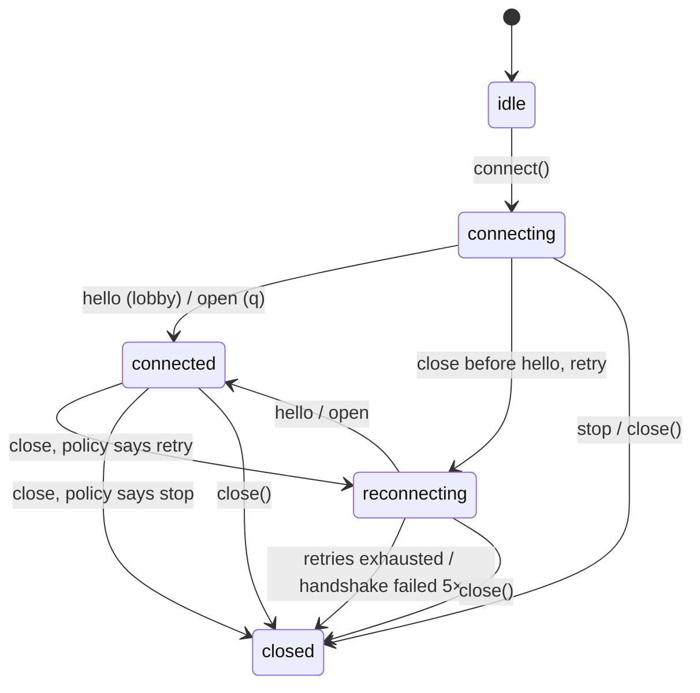

# Connection lifecycle

Both clients run one state machine. This page is what it does between `connect()`
and the end, and which stream tells you.

## Connecting

`connect()` opens the WebSocket with `?channel=…` (and `&gameId=…` for `q`) and the
subprotocol list `['bearer', token]`. The gateway must echo `bearer`; a server that
does not is not the gateway, and the client stops. A lobby client then waits for
`hello` — `connect()` completes with it, and `lobby.hello`, `capabilities` and `peers`
are set before any listener runs. A `q` client is connected when the socket opens.

Call `connect()` once. A second call throws `StateError`; a new session is a new
client.

## States

`state` reads the current one; `stateChanges` streams every transition.

## Events and their order

For one reconnect cycle a lobby client emits, in this order:

1. `connected(hello)` — the first `hello`.
2. `disconnected(code, reason, willReconnect: true)` — the socket went away;
   `peers` is already empty.
3. `reconnecting(attempt: 1, delayMs: 500)`.
4. `connected(hello)` again — the gateway sent a fresh `hello`; a `party` roster may
   follow; the peer map stays empty until you send `pos` and a `snapshot` arrives.

And for the end:

5. `disconnected(code, reason, willReconnect: false)`.
6. `stopped(kind, reason, code)` — terminal. On `q`, `aborted` or `finished` replace
   `stopped` for `4001` and `1000`.

Every stream is a synchronous broadcast: a listener added before `connect()` sees
everything, in this order. `reason` is always SDK-authored text; the gateway's close
reason is never surfaced (it may quote what you sent) — only its length is logged.

## Reconnect policy

| Close code | Meaning | The client |
| --- | --- | --- |
| `4000` | replaced by a newer socket of yours | stops |
| `4001` | `q`: the actor stopped consuming | `aborted`; retry with a **new** `gameId` |
| `4002` | idle: no pong within 75 s | reconnects |
| `4003` | 50 refused messages on one socket | stops (`clientBug`) |
| `4004` | the channel expired or was disabled | stops |
| `4005` | too slow; the outbound queue filled | reconnects; the next `snapshot` resyncs |
| `1000` | `q`: the game dropped you, a normal finish; lobby: closed normally | `finished` / stops |
| `1001` | gateway restarting | reconnects with backoff |
| `1003`, `1009` | binary frame / frame over 16 KB | stops (`clientBug`) |
| `1011` | `q`: the enter push failed | reconnects |
| `1006`, anything else | network | reconnects |

Two local decisions ride on top: a lobby socket with no `hello` within
`helloTimeoutMs` (10 s) is closed with `4900` and retried; and a socket that closes
before it opened counts a **handshake failure** — five in a row stop the session,
because a refused token (`401`), a wrong channel (`404`, `410`) or a `q` you are not a
member of (`403`) all look the same to a WebSocket client: a close before open. A
successful open resets the count.

## Backoff

Delays are `500 ms × 2^n`, capped at 15 s, with ±20 % jitter from a per-client random
source, so two clients that lost the same gateway do not return in lock-step. A
successful `hello` (or open) resets the sequence. `BackoffOptions.maxAttempts` turns
"forever" into a number; the default is unbounded, because the handshake-failure
count already ends a dead session.

## App lifecycle

iOS suspends sockets when the app pauses; Android may. Expect a `disconnected` on
resume and let the policy run — `4002` reconnects. If you want a clean end instead,
`close()` on `paused` from a `WidgetsBindingObserver` and create a new client on
`resumed`. [Flutter](flutter.md) has the wiring.

## Shutting down

`close()` is idempotent and does four things: cancels any pending reconnect, sends
`1000 client closed`, emits one final `disconnected(willReconnect: false)` if the
socket was open, and closes every stream. Call it from `dispose()`. A `connect()`
still pending fails with `GatewayStoppedException`.
