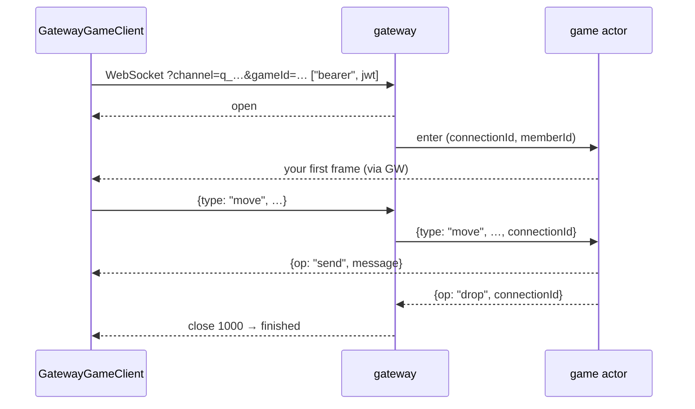

# Dungeon

A `q` channel bridges a socket to **your** game actor. The gateway defines no
vocabulary here: every frame is the game's, and `GatewayGameClient` is a typed
passthrough whose only protocol knowledge is the connect sequence, the two reserved
inbound types, and the difference between an aborted run and a finished one.

## Getting a `gameId`

Your game's own HTTP API starts a run: it reads the party roster the gateway mirrors
(`GET /parties/{partyId}?channel=…` with a member's token), writes the start event
naming the members, and returns a `gameId`. Only a member named in that event may
connect; anyone else is refused at the handshake with `403`, one code for "unknown
game" and "not a member", so ids cannot be probed.

## Connecting

```dart
final game = GatewayGameClient(GatewayGameClientOptions(
  url: url, channelId: qChannelId, gameId: gameId, token: jwt,
));
game.connected.listen((_) => game.send({'type': 'ready'})); // usable inside the handler
game.frames.listen((frame) => apply(frame));
await game.connect();
```

There is no `hello`: `connect()` completes when the socket is open with `bearer`
echoed, and by then the gateway has pushed `enter` to the actor, which answers with
whatever your game defines. The same happens again after a reconnect.



## Frames

Inbound frames must be a JSON object with a string `type` that is not `enter` or
`leave` — the gateway synthesises those and refuses them with `reserved_type`; the
SDK refuses them locally too. The gateway overwrites `connectionId` and strips any
`memberId` you send: **`connectionId` is the only field an actor may trust**.

Outbound frames are forwarded verbatim and may be any JSON value, so `frames` is a
`Stream<Object?>`. A gateway refusal (`{type: "error", code}`) is split off onto
`refused`; the codes that matter here are `reserved_type`, `rate_limited` (20/s,
burst 2×), `bad_message` and `unavailable`.

## Finished versus aborted

| Close | Stream | What happened | What to do |
| --- | --- | --- | --- |
| `1000` | `finished` | the game dropped you (`{op: "drop"}`) — a normal end | show the result |
| `4001` | `aborted` | the actor stopped consuming (queue depth over 200, or over 20 for 5 s) | show "server stopped responding", return to the lobby, retry with a **new** `gameId` |
| `1011` | reconnects | the enter push failed | nothing; the client retries the connect |
| `4000`, `4004`, `4003` | `stopped` | replaced, channel gone, policy | as in the lobby |

Neither `finished` nor `aborted` reconnects; both also emit `disconnected(false)`.
Three `unavailable` refusals in a row become a `4001`.

## Retrying

A retry after `4001` needs a fresh `gameId` from your game's API — the old queue was
deleted. A retry after anything else is a new client with the same `gameId` and the
same token.
