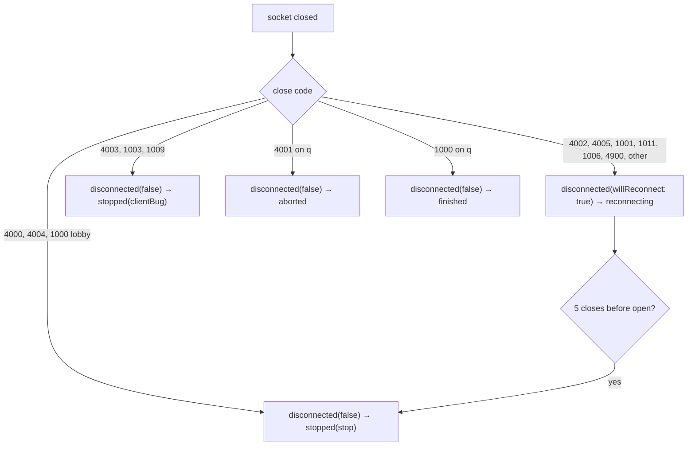

# Errors

Three kinds: a **refusal** the gateway sends back as a frame, a **close** that ends the
socket, and an **exception** the SDK throws before anything reaches the wire.

## Refusals

`{ "type": "error", "code": "…", "message": "…" }`, delivered on `refused`. The
connection stays up. Log the code, never the message — it may quote what you sent.

| Code | Sent by | Why you would hit it |
| --- | --- | --- |
| `bad_message` | any | not a JSON object with a string `type`, a field of the wrong type (`dir` not a string, `x`/`y` not numbers), `dir` over 16 bytes, or an `event` without a `name` |
| `capability_off` | `pos`, `say`, `event`, `party.*` | the channel has that feature off; the SDK refuses these locally too when `hello` said so |
| `rate_limited` | any | over the channel's per-connection bucket (lobby: `rateLimit`/s; `q`: 20/s, burst 2×) |
| `bad_scope` | `say`, `event` | `scope` is not `zone`, `party` or `user`; a known scope the channel has off is `capability_off` |
| `bad_zone` | `pos`, zone-scoped `say`/`event` | a bad `zone`, or a zone message before your first `pos` |
| `move_too_far` | `pos` | a jump over `maxMoveDelta` inside one zone |
| `unknown_user` | `to`, `party.invite` | nobody online by that id |
| `no_party` | party `say`/`event`, `party.invite/leave` | you are in none |
| `already_in_party` | `party.create`, `party.invite` | you, or the invitee, already are |
| `party_full` | `party.invite`, `party.accept` | at `partySizeMax` |
| `not_invited` | `party.accept/decline` | no pending invite for you |
| `unknown_party` | `party.accept/decline` | no such party |
| `not_leader` | `party.invite` | only the leader invites |
| `too_long` | `say`, `event` | `text` empty or over 1024 B, `name` over 64 B, payload over 8 KB |
| `reserved_type` | `q` | you sent `enter` or `leave`; the SDK refuses these locally |
| `unavailable` | `q` | the push to the actor failed; three in a row abort the run |
| `frame_too_large` | gateway → you | a frame meant for you exceeded 32 KB and was dropped; you have a gap |

Fifty refusals on one socket close it with `4003`.

## What the SDK does not check

Byte limits (`text`, `name`, `payload`, `zone`) and rates. It checks only what
`hello` told it (`capability_off`), the 16-byte `dir`, and the reserved `q` types —
a fast error, not the enforcement. Stay under the gateway's limits yourself.

## Exceptions

| Thrown by | Type | When |
| --- | --- | --- |
| `connect()` | `GatewayStoppedException` | the connection stopped before it became usable |
| `connect()` again | `StateError` | one session per client |
| any sender | `StateError` | not connected, or `capability_off` from `hello` |
| `pos(dir:)` | `ArgumentError` | `dir` over 16 bytes |
| `send()` on `q` | `StateError` | `type` is `enter` or `leave` |
| `map()` | `StateError` / `MapFetchException(status, reason)` | before `hello` / the fetch failed (`status`, `timeout`, `tooLarge`, `network`, `badUrl`) |
| `AuthClient` | `AuthFailure(kind, status)` | see [Authentication](authentication.md) |
| `KvStoreClient` | `KvStoreException(status, code)` / `ArgumentError` | the store or the network refused / a key, name, owner, value size, `ttl`, `limit` or `ifMatch` the server would refuse; see [Key-value store](kvstore.md) |
| `WebSocketChannelFactory.connect` | `ArgumentError` | a subprotocol with an illegal character (reported by index), a URL that is not `ws`/`wss` |

None of these carries a token, a body or a URL in its message.

## Close codes

Which stream you get, by code:

| Code | Meaning |
| --- | --- |
| `4000` | replaced by a newer socket of the same user on this channel; the other tab won |
| `4001` | `q`: the actor stopped consuming; retry only with a new `gameId` |
| `4002` | idle: no pong within 75 s |
| `4003` | policy: 50 refused messages on one socket — fix the client |
| `4004` | the channel expired or was disabled |
| `4005` | too slow: the outbound queue filled with control frames; a fresh `snapshot` resyncs |
| `4900` | what the SDK sends when *it* closes: a hello timeout or a wrong subprotocol (each with its own reason and disposition), or an inbound text frame over `maxInboundMessageBytes` (64 KiB), which reconnects. Never sent by the gateway |
| `1000` | `q`: a normal finish; lobby: closed normally |
| `1001` | gateway restarting |
| `1003` | you sent a binary frame |
| `1009` | you sent a frame over 16 KB |
| `1011` | `q`: the enter push failed |

## Handshake refusals

HTTP, before the upgrade, invisible to a WebSocket client except as a close before
open — which is why five of them in a row end the session:

| Status | Meaning |
| --- | --- |
| `400` | no `channel` |
| `401` | no or rejected token (not JWT-shaped, expired, or refused by the auth channel) |
| `403` | `q`: unknown game, or you are not in its start event — one code, so game ids cannot be probed |
| `404` | unknown or malformed channel id, or not a gateway channel |
| `410` | the channel expired or was disabled |
| `429` | more than 10 handshakes in a burst from one address |
| `502`, `503` | console or auth unreachable; gateway not configured, full, or shutting down |

## Protocol errors

`protocolErrors` reports a frame that was not the protocol — not JSON, not an object,
no string `type`, a binary frame, an unknown `type`, or a non-`hello` first frame. The
frame is ignored and the connection stays up. The message names a code and an offset,
or the peer-chosen `type` capped at 32 characters with control characters stripped;
it is safe to log.
