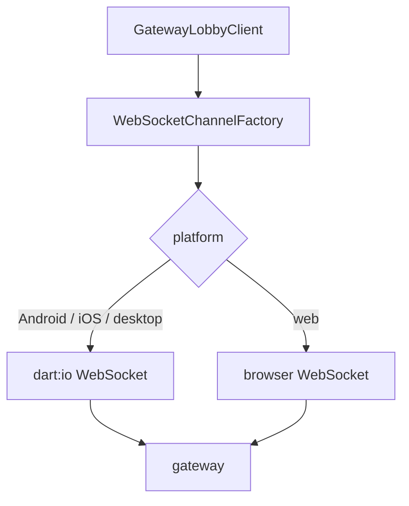

# Flutter

The packages are pure Dart; this page is the app around them.

## Platforms

One transport, `package:web_socket_channel`, on every platform. The token rides the
WebSocket subprotocol list because that is the one place a browser lets a client put
a credential — there are no custom headers on a browser WebSocket — and the same
path is then used on `io` platforms for uniformity.



- **Web:** a refused handshake (`401`, `403`, `404`, `410`) is invisible except as a
  close before open, so a dead token ends in `stopped` after `maxHandshakeFailures`,
  not in an error you can read. `verify()` from `yingyeothon_auth_client` is the way to
  tell them apart.
- **Web:** the redirect sign-in lands on your page; read `Uri.base` (the fragment is
  there), call `parseRedirect`, then replace the history entry so the fragment is gone.
- **Android / iOS:** the redirect arrives as a deep link (`app_links` or the platform
  API). Register the URL on the channel's allowlist first.

## Background and resume

iOS suspends sockets when the app pauses; Android may. Expect a `disconnected` on
resume and let the policy run (`4002` idle → reconnect). To end cleanly instead:

```dart
class _LobbyState extends State<LobbyPage> with WidgetsBindingObserver {
  @override
  void didChangeAppLifecycleState(AppLifecycleState state) {
    if (state == AppLifecycleState.paused) lobby.close();
    if (state == AppLifecycleState.resumed && lobby.state == GatewayClientState.closed) {
      _createAndConnect(); // a new client; the old one is spent
    }
  }
}
```

## Widgets, streams and `dispose()`

Every SDK stream is a synchronous broadcast on the event loop — no isolate, no
thread. A listener that calls `setState` checks `mounted`; a `State` that holds a
client cancels its subscriptions and closes the client:

```dart
import 'dart:async';

late final StreamSubscription<List<Peer>> _moved;

@override
void initState() {
  super.initState();
  _moved = lobby.peerMoved.listen((_) { if (mounted) setState(() {}); });
}

@override
void dispose() {
  _moved.cancel();
  lobby.close();
  super.dispose();
}
```

`peerMoved` fires at most once per `hello.tick`; render from `lobby.peers.all()`
rather than from each frame. For a `StreamBuilder`, `lobby.stateChanges` and
`lobby.partyChanged` are the natural inputs.

## Logging

Route the SDK's lines through `debugPrint` in debug builds and drop them in release:

```dart
final logger = kDebugMode
    ? createFilteredLogger(
        severity: LogSeverity.debug,
        writer: LogWriters.fromFunction((s, m, c) => debugPrint(LogWriters.format(s, m, c))))
    : nullLogger;
```

The SDK logs ids, codes and lengths and never a token, a frame body or a payload — a
writer that persists is safe to attach.

## Debug-only hooks and `kDebugMode`

The [playground](../examples/playground/README.md) gates every affordance that helps
verification behind `kDebugMode`: the offline demo (an in-process
`yingyeothon_fake_gateway`), peer seeding, a forced close code, a `q` abort. `flutter
test` runs in debug mode, so widget tests reach them; a `--release` build cannot.
Copy the pattern: a `debug/` folder, a `kDebugMode` check at each entry, and nothing
of it in a package.

## Desktop verification

Verify on the desktop of your host first — `flutter run -d linux`, `-d macos` or
`-d windows` — because it is the build you can drive directly, then on web (the
subprotocol path in a browser) and on a phone (background and resume). The offline
demo needs no credential; real values go in with `--dart-define=YYT_*`, never as
literals in the tree.
