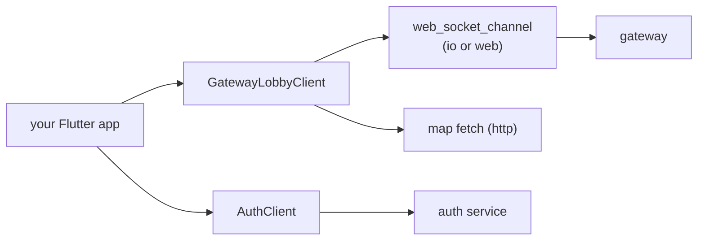

# Getting started

From an empty Flutter project to a client that connects, enters a zone and sees a
peer move. Do it on Linux, macOS or Windows desktop first: it is the build you can
drive directly, and the offline demo needs no credential.

## 1. Add the packages

```yaml
dependencies:
  yingyeothon_gamebase_client:
    git:
      url: https://github.com/yingyeothon/flutterlib.git
      path: packages/yingyeothon_gamebase_client
  yingyeothon_auth_client:
    git:
      url: https://github.com/yingyeothon/flutterlib.git
      path: packages/yingyeothon_auth_client
```

Append `ref: v0.1.0` (or the tag you want) to each once a release exists; until then
they track `main`. The siblings each one needs (`codec`, `logger`) are path
dependencies inside the same checkout, so nothing else is declared. The packages are
pure Dart, so this works on every platform.

## 2. Collect four values from the console

| Value | Where | Goes into |
| --- | --- | --- |
| gateway origin, e.g. `wss://gw.yyt.life` | the lobby channel page, `wsUrl` (drop the query) | `GatewayClientOptions.url` |
| lobby channel id, `lobby_…` | the same page | `GatewayClientOptions.channelId` |
| auth base URL, e.g. `https://auth.yyt.life` | the auth channel page | `AuthClient(baseUrl:)` |
| auth channel id, `auth_…` | the same page | `AuthClient(channelId:)` |

[Console and options](console-and-options.md) lists every field. Pass them with
`--dart-define=YYT_GATEWAY_URL=…` and friends, never as literals in the tree.

## 3. Sign in

A channel JWT is the only credential. The shortest path on a phone is the browser
redirect; on a desktop or in a test you can paste one. [Authentication](authentication.md)
has both flows; the essence:

```dart
import 'package:yingyeothon_auth_client/yingyeothon_auth_client.dart';

final auth = AuthClient(baseUrl: Uri.parse(authBaseUrl), channelId: authChannelId);
final nonce = AuthClient.newNonce();
final start = auth.buildStartUrl(provider: 'github', redirect: myRedirect, nonce: nonce);
// open `start` in the browser; when the app receives `returned`:
final token = auth.parseRedirect(returned, expectedNonce: nonce);
```

## 4. Create the lobby client and listen

```dart
import 'package:yingyeothon_gamebase_client/yingyeothon_gamebase_client.dart';

final lobby = GatewayLobbyClient(GatewayLobbyClientOptions(
  url: gatewayUrl,
  channelId: lobbyChannelId,
  token: token.jwt,
));

lobby.snapshots.listen((_) => setState(() {}));
lobby.peerEntered.listen((_) => setState(() {}));
lobby.peerLeft.listen((_) => setState(() {}));
lobby.peerMoved.listen((_) => setState(() {}));
lobby.stopped.listen((e) => showDialog(context: context, builder: (_) => Text(e.reason)));

final hello = await lobby.connect();
```

`connect()` completes when the gateway's `hello` arrives, not when the socket opens;
after that `lobby.hello`, `lobby.capabilities` and `lobby.peers` are filled. It throws
`GatewayStoppedException` if the connection stops first (a refused token, a gone
channel), so `await` it in a `try`.

The app is one of these pieces; the packages are the middle two:



## 5. Send your position

```dart
lobby.pos(zone: hello.zone, x: 3, y: 4, dir: 'n');
```

The first `pos` enters the zone; the gateway answers with a `snapshot` of everyone in
view, and from then on `peerEntered`, `peerLeft` and `peerMoved` keep `lobby.peers`
current. Render from `lobby.peers.all()`, once per `hello.tick` milliseconds at most.
[Lobby](lobby.md) covers chat, events, parties and the map.

## 6. Run it on desktop

```bash
flutter run -d linux \
  --dart-define=YYT_GATEWAY_URL=wss://gw.yyt.life \
  --dart-define=YYT_CHANNEL_ID=lobby_… \
  --dart-define=YYT_AUTH_BASE_URL=https://auth.yyt.life \
  --dart-define=YYT_AUTH_CHANNEL_ID=auth_…
```

Or skip all four and run the [playground](../examples/playground/README.md) with its
**Offline demo**: it starts a fake gateway in the process and your client talks to it
over the real transport. That is also how the SDK's own end-to-end tests run.

## 7. Keep going

- Every close code and what the client does: [Connection lifecycle](connection-lifecycle.md).
- Every refusal you can get back: [Errors](errors.md).
- Announcements and a player's own record over HTTP, with the same token:
  [Key-value store](kvstore.md).
- Web, background, `dispose()`: [Flutter](flutter.md).
