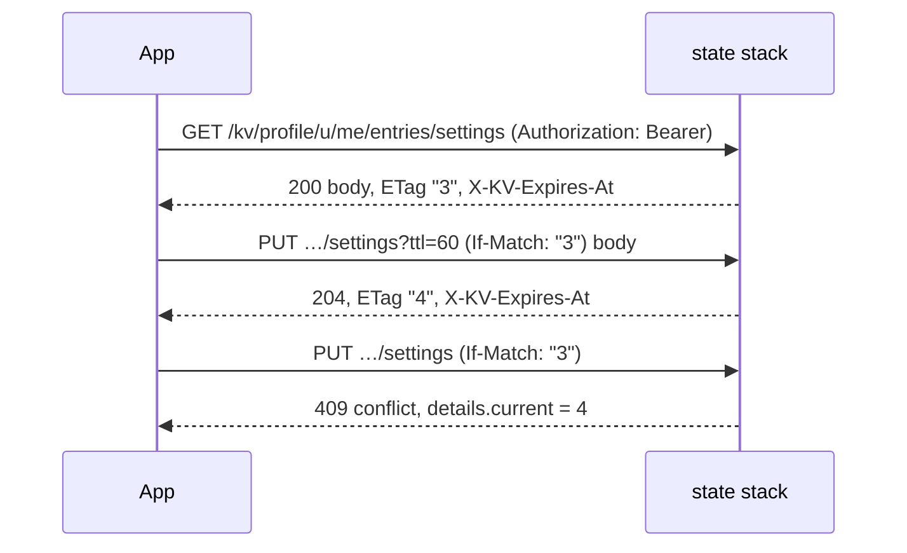

# Key-value store

Read what the team publishes and keep a player's own record, with the channel JWT
the game already holds. `yingyeothon_kvstore_client` implements it; the store itself
belongs to the [`service`](https://github.com/yingyeothon/service) repository
(`services/state/README.md`, _KV routes_, and `docs/kvstore.md`), which is right when
this page disagrees.

## The shape of it

Your team creates a **collection** in the console: a name, a `readScope`, a
`writeScope`, an `encrypted` flag and two caps. The two scopes decide who may do what
through the API:

| Scope | Who | Where the entries live |
| --- | --- | --- |
| `team` | the console and `yyt kv` only; the API answers `403` | — |
| `project` | any credential of the project: a player's JWT or the game server's key | the shared namespace, `/kv/{col}/entries` |
| `user` | the server on anyone's behalf; a player on its own entries | one namespace per owner, `/kv/{col}/u/{ownerId}/entries`; `me` is the player |

`writeScope: user` is what puts entries under an owner; using the other path is a
`400` with `reason` `wrong_namespace`, and `collection.info()` tells you which one
applies before you guess.

## The two cases

```dart
import 'package:yingyeothon_kvstore_client/yingyeothon_kvstore_client.dart';

final kv = KvStoreClient(KvStoreClientOptions(
  baseUrl: Uri.parse('https://doc.yyt.life'),
  token: token.jwt,
));

// (1) announcements: readScope project, writeScope team. Players read, the team
// writes in the console.
final notices = await kv.collection('announcements').list(values: true, order: KvOrder.desc);

// (2) my record: readScope user, writeScope user (encrypted if you like). Only this
// player, and your server, ever see it.
final mine = kv.collection('profile').mine;
final saved = await mine.get('settings', orElse: () => null) as Map<String, Object?>?;
await mine.put('settings', {...?saved, 'volume': 0.5});
```

The base URL is `https://doc.yyt.life` on prod and `https://doc-dev.yyt.life` on dev;
pass it with `--dart-define=YYT_KV_BASE_URL=…` like the other values ([Console and
options](console-and-options.md)). `collection()` takes the console name or the `kv_`
id, resolved within the project your auth channel belongs to.

## What a read and a write carry



- **Version.** Every entry has one, monotonic per key; `getEntry().version` and
  `put().version` carry it. Pass it back as `ifMatch` to write only what you read, or
  `ifNoneMatch: true` to create only. A lost race is
  `KvStoreException.isVersionMismatch` (a `409` without a `reason`; `isConflict` is
  every `409`, the caps included) with `currentVersion` for a reader.
- **TTL.** `ttl` is seconds (1 s to 366 days); `0` clears the expiry; omitted keeps
  it. An expired entry is invisible to every read, but its version keeps climbing.
- **A write-only caller** (`writeScope` admits it, `readScope` does not) gets `204`,
  no version and no `created` (`expiresAt` still, when that write set a `ttl`), and a
  conditional write is a `403`. "Did this key exist" is a fact about stored data.
  Its `delete()` is `204` for a missing key too; a reader's is `404`, which the
  client folds into success either way.
- **Counters.** `incr(key, delta)` is the one operation the server performs on a
  value; it is atomic, starts a missing key at zero, and needs the read right.
- **Listing.** `list(prefix:, limit:, order:, values:)` pages by `nextCursor`; with
  `values: true` each row decodes its value and sets `hasValue`.

## Absent versus `null`

A stored JSON `null` is a Dart `null`, so a missing key cannot be `null` too.
`getEntry()` returns `null` for a missing key; `get()` calls `orElse` for one, and
throws `KvStoreException(404, 'not_found')` without it. A collection your project
does not have is the same `404` (on purpose, see below), so it reads as a missing
key as well; `info()` tells the two apart. The snippet above uses
`orElse: () => null` because "no settings yet" and "settings are null" mean the same
thing there.

## Refusals

| Status | `code` / `reason` | Why you would hit this |
| --- | --- | --- |
| `400` | `bad_request`, `reason: wrong_namespace` | the shared path on a user-scoped collection, or the reverse; read `info()` |
| `401` | `unauthorized` | the token expired or is for another stage; sign in again |
| `403` | `forbidden` | the scope refuses this token, or a conditional write without the read right |
| `404` | `not_found` | no such key; or no such collection in this project (the same answer on purpose) |
| `409` | `conflict`, `details.current` | a lost compare-and-set; `isVersionMismatch` |
| `409` | `reason: collection_full` / `owner_full` | a cap; `isFull` |
| `409` | `reason: not_a_number` / `overflow` | `incr` on a non-number, or past the safe integer range |
| `409` | `reason: encrypted` | a console write to an encrypted collection; not reachable from the API |
| `413` | — | a value over 16 KiB; the client refuses it locally first |
| `503` | `kv_encryption_not_configured`, `kv_value_unreadable`, `unavailable` | the stage; nothing to do on the client |

Local refusals (`ArgumentError`, before any request) mirror the server's grammar and
bounds and nothing else; `KvRules` holds the constants.

## Browser builds

Nothing to add: the store answers CORS preflights for every origin, admits
`Authorization`, `If-Match` and `If-None-Match`, and exposes `ETag` and
`X-KV-Expires-At`. The token comes from the sign-in flow
([Authentication](authentication.md)) and this package never stores it.
