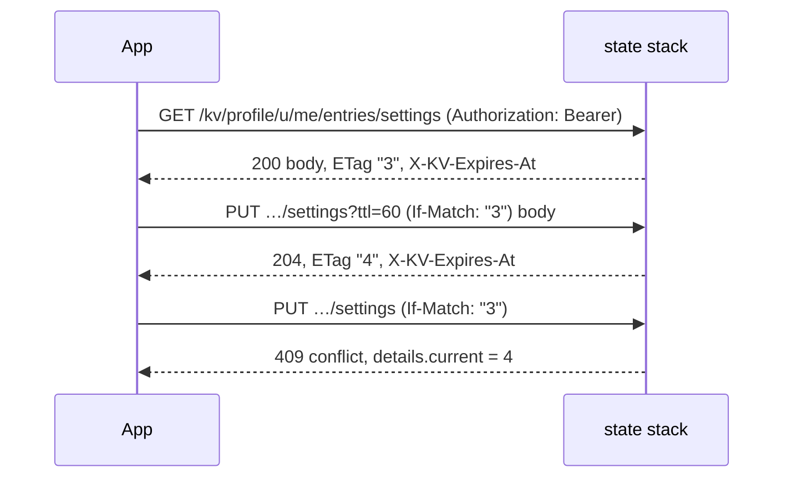

# Key-value store

Read what the team publishes and keep a player's own record, with the channel JWT
the game already holds. `yingyeothon_kvstore_client` implements it; the store itself
belongs to the [`service`](https://github.com/yingyeothon/service) repository
(`services/state/README.md`, _KV routes_, and `docs/kvstore.md`), which is right when
this page disagrees.

## The shape of it

Your team creates a **collection** in the console: a name, a `readScope`, a
`writeScope`, an `encrypted` flag and two caps. The two scopes decide who may do what
through the API:

| Scope | Who | Where the entries live |
| --- | --- | --- |
| `team` | the console and `yyt kv` only; the API answers `403` | — |
| `server` | the game server's key (the auth channel's doc apiKey) and the console; a player's JWT is a `403` | the shared namespace, or per owner (below) |
| `project` | any credential of the project: a player's JWT or the game server's key | the shared namespace, `/kv/{col}/entries` |
| `user` | the server on anyone's behalf; a player on its own entries | one namespace per owner, `/kv/{col}/u/{ownerId}/entries`; `me` is the player |

**Either** scope being `user` puts the entries under an owner
(`KvCollectionInfo.isUserNamespace`); using the other path is a `400` with `reason`
`wrong_namespace`, and `collection.info()` tells you which one applies before you
guess. The `server` scope needs the doc apiKey, so it belongs to a game server, a
Lambda or a cron — never to a key shipped inside the app.

The same host also serves a per-player document store (`/s/{ownerId}`, one blob per
player; every `PUT` is conditional and writes take the auth channel's doc apiKey from
the console, so a player can only read its own row, with a plain `GET` and its
Bearer token). This library has no client for it and will not. For state a player
writes itself, use a `user`-scoped collection — their own entries, versioned, with
`ifMatch` for a compare-and-set; **a player-writable collection is not the place for
state the server must vouch for** (currency, inventory): give it `writeScope:
server`, so only your game server writes it and the player reads it, or have the
server write `/s/*` directly.

## The two cases

```dart
import 'package:yingyeothon_kvstore_client/yingyeothon_kvstore_client.dart';

final kv = KvStoreClient(KvStoreClientOptions(
  baseUrl: Uri.parse('https://doc.yyt.life'),
  token: token.jwt,
));

// (1) announcements: readScope project, writeScope team. Players read, the team
// writes in the console.
final notices = await kv.collection('announcements').list(values: true, order: KvOrder.desc);

// (2) my record: readScope user, writeScope user (encrypted if you like). Only this
// player, and your server, ever see it.
final mine = kv.collection('profile').mine;
final saved = await mine.get('settings', orElse: () => null) as Map<String, Object?>?;
await mine.put('settings', {...?saved, 'volume': 0.5});
```

The base URL is `https://doc.yyt.life` on prod and `https://doc-dev.yyt.life` on dev;
pass it with `--dart-define=YYT_KV_BASE_URL=…` like the other values ([Console and
options](console-and-options.md)). `collection()` takes the console name or the `kv_`
id, resolved within the project your auth channel belongs to.

## What a read and a write carry


```mermaid
sequenceDiagram
  participant App
  participant KV as state stack
  App->>KV: GET /kv/profile/u/me/entries/settings (Authorization: Bearer)
  KV-->>App: 200 body, ETag "3", X-KV-Expires-At
  App->>KV: PUT …/settings?ttl=60 (If-Match: "3") body
  KV-->>App: 204, ETag "4", X-KV-Expires-At
  App->>KV: PUT …/settings (If-Match: "3")
  KV-->>App: 409 conflict, details.current = 4
```

- **Version.** Every entry has one, monotonic per key; `getEntry().version` and
  `put().version` carry it. Pass it back as `ifMatch` to write only what you read, or
  `ifNoneMatch: true` to create only. A lost race is
  `KvStoreException.isVersionMismatch` (a `409` without a `reason`; `isConflict` is
  every `409`, the caps included) with `currentVersion` for a reader.
- **TTL.** `ttl` is seconds (1 s to 366 days); `0` clears the expiry; omitted keeps
  it. An expired entry is invisible to every read, but its version keeps climbing.
- **A write-only caller** (`writeScope` admits it, `readScope` does not) gets `204`,
  no version and no `created` (`expiresAt` still, when that write set a `ttl`), and a
  conditional write is a `403`. "Did this key exist" is a fact about stored data.
  Its `delete()` is `204` for a missing key too; a reader's is `404`, which the
  client folds into success either way.
- **Counters.** `incr(key, delta)` is the one operation the server performs on a
  value; it is atomic, starts a missing key at zero, and needs the read right.
  `min:` and `max:` bound the result of that one call (nothing stores them): lives
  that cannot go below zero are `incr('lives', -1, min: 0)`, and a result outside
  the bounds writes nothing and is `isOutOfRange`.
- **Listing.** `list(prefix:, limit:, order:, values:)` pages by `nextCursor`; with
  `values: true` each row decodes its value and sets `hasValue`.

## Mail and the writer stamp

A collection with `readScope: user` and `writeScope: project` is an inbox
(`KvCollectionInfo.acceptsMail`): only the owner reads its namespace, and any
player of the project may put something into it.

```dart
final inbox = kv.collection('mail');
final myId = token.userId; // the ChannelToken from sign-in; hello.userId echoes it
// To a friend (a party member's or a peer's userId, or row.from to reply):
// create-only, and the key starts with your own user id and a colon.
await inbox.owner(friendId).put(
  '$myId:gift-${DateTime.now().millisecondsSinceEpoch}',
  {'gold': 5},
  ttl: 7 * 24 * 60 * 60,
);
// Your own mail. A listing is in key order, which here is by sender, so sort by
// time yourself.
// (One page here; follow nextCursor first to sort the whole inbox.)
final page = await inbox.mine.list(values: true);
final mail = [...page.entries]..sort((a, b) => b.updatedAt.compareTo(a.updatedAt));
```

- The write into another player's namespace is **create-only**: no `ifMatch` or
  `ifNoneMatch` (a `400`), and a key already there is `isKeyTaken`. The sender may
  never delete or `incr` it (`403`); the owner may overwrite or delete it.
- The key must begin with the sender's own user id and a colon (a `400` otherwise),
  which gives every sender its own slice of each inbox. The client does not check
  it; a wrong id is only that `400`. A token whose subject is not an owner id (32 hex
  or `{kind}:{id}`; only a token your game signs itself can differ) may not send
  mail at all (`403`).
- `maxEntriesPerOwner` bounds the inbox (`owner_full`) **and** what one player has
  sent across all inboxes of the collection (`sender_full`); both are `isFull`. A
  sent row counts until the recipient deletes or overwrites it or it expires, so
  give mail a `ttl`, or one idle inbox uses up a sender's quota.
- In an owner namespace the platform stamps the **writer**: `KvEntry.from` (a user
  id, `server` or `team`) with `KvEntry.updatedAt`, and `KvListEntry.from`. The
  writer cannot choose it. Every accepted write re-stamps the row, the owner's own
  overwrite included, so mark mail read by deleting it or by keeping read state
  elsewhere; the key's prefix still names the sender. A shared namespace, a row
  from before stamps existed and a writer whose subject is not an owner id have no
  stamp.
- With `writeScope: server` the same shape is a notice board only your game server
  writes into, one namespace per player.
- A mail value is whatever another player wrote. Before showing text from it, drop
  what cannot be shown safely (controls, bidi and zero-width characters); the
  example's `MapLayout._isLabel` in `examples/playground/lib/map_layout.dart` is a
  reference list.

## The platform clock

`kv.serverTime()` is `GET /time`, the platform's clock in UTC. The request carries
no token, but it goes through a `KvStoreClient`, so it comes after sign-in. A
client-only game has no clock it can trust for a daily reset or an event window;
call it once per session and keep the offset from the device clock:

```dart
final offset = (await kv.serverTime()).difference(DateTime.now());
DateTime now() => DateTime.now().add(offset);
```

Do not poll it: it shares the stage's request budget with every kv call. The fake
gateway's `/time` is the real clock of the machine it runs on.

## Absent versus `null`

A stored JSON `null` is a Dart `null`, so a missing key cannot be `null` too.
`getEntry()` returns `null` for a missing key; `get()` calls `orElse` for one, and
throws `KvStoreException(404, 'not_found')` without it. A collection your project
does not have is the same `404` (on purpose, see below), so it reads as a missing
key as well; `info()` tells the two apart. The snippet above uses
`orElse: () => null` because "no settings yet" and "settings are null" mean the same
thing there.

## Refusals

| Status | `code` / `reason` | Why you would hit this |
| --- | --- | --- |
| `400` | `bad_request`, `reason: wrong_namespace` | the shared path on a user-scoped collection, or the reverse; read `info()` |
| `400` | `bad_request` | mail with a condition, or a mail key that does not start with your id and a colon |
| `401` | `unauthorized` | the token expired or is for another stage; sign in again |
| `403` | `forbidden` | the scope refuses this token, a conditional write without the read right, a sender's `delete` or `incr` in another player's namespace, or mail from a token whose subject is not an owner id |
| `404` | `not_found` | no such key; or no such collection in this project (the same answer on purpose) |
| `409` | `conflict`, `details.current` | a lost compare-and-set; `isVersionMismatch` |
| `409` | `reason: collection_full` / `owner_full` / `sender_full` | a cap; `isFull` |
| `409` | `reason: exists` | a mail key already there; `isKeyTaken` |
| `409` | `reason: out_of_range` | `incr` past its `min` or `max`; `isOutOfRange` |
| `409` | `reason: not_a_number` / `overflow` | `incr` on a non-number, or past the safe integer range |
| `409` | `reason: encrypted` | a console write to an encrypted collection; not reachable from the API |
| `413` | — | a value over 16 KiB; the client refuses it locally first |
| `503` | `kv_encryption_not_configured`, `kv_value_unreadable`, `unavailable` | the stage; nothing to do on the client |

Local refusals (`ArgumentError`, before any request) mirror the server's grammar and
bounds and nothing else; `KvRules` holds the constants.

## Browser builds

Nothing to add: the store answers CORS preflights for every origin, admits
`Authorization`, `If-Match` and `If-None-Match`, and exposes `ETag`,
`X-KV-Expires-At`, `X-KV-From` and `X-KV-At`. The token comes from the sign-in flow
([Authentication](authentication.md)) and this package never stores it.
