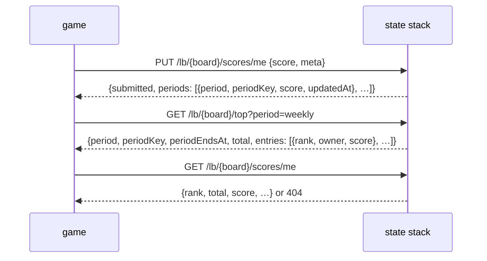

# Leaderboards

Rank players by a score the game submits, with the channel JWT the game already
holds. `yingyeothon_leaderboard_client` implements it; the boards themselves belong
to the [`service`](https://github.com/yingyeothon/service) repository
(`services/state/README.md`, _LB routes_, and `docs/leaderboard.md`), which is right
when this page disagrees.

## The shape of it

Your team creates a **board** in the console (`yyt lb create`): a name, who may
`submit`, a `rule`, an `order`, the `periods` it keeps and a cap per bucket. Four of
those never change; a board that changed how a score meets the stored one would be
ranking rows written under two rules.

| Setting | Values | What it decides |
| --- | --- | --- |
| `submit` | `server`, `owner` | who may write: `server`, only the game server's key; `owner`, a player's own row too. Reads are open to every credential of the project |
| `rule` | `best`, `latest`, `sum` | how a new score meets the stored one |
| `order` | `desc`, `asc` | which end ranks first; `asc` is for times |
| `periods` | subset of `alltime`, `daily`, `weekly`, kept in that order | one bucket per period; a submission writes all of them; the first kept one is what `top()` and `score()` read when no period is named |
| `maxEntries` | 1 … 10 000 | rows per bucket; a full bucket refuses the **whole** submission |

A **bucket** is one period's current slice: `alltime` is one for ever, `daily` is
today in `Asia/Seoul`, `weekly` the ISO week. The platform computes the key from
its own clock and every answer carries it (`LbBucket.periodKey`,
`periodEndsAt`), so a client never derives a bucket from the device's clock, and a
daily reset is "the key changed", not "midnight passed here".



## The case the playground shows

A `submit: owner` board the player writes its own row to, then the page and its
rank:

```dart
import 'package:yingyeothon_leaderboard_client/yingyeothon_leaderboard_client.dart';

final lb = LeaderboardClient(LeaderboardClientOptions(
  baseUrl: Uri.parse('https://doc.yyt.life'), // the key-value store's host
  token: token.jwt,
));
final race = lb.board('race');

final result = await race.submit(70);
final kept = result.periods.first.score; // what the bucket holds now

final page = await race.top();           // the board's first period
final mine = await race.score();         // null while I have no row
```

`submit` answers with what every bucket holds **after** the write, which is how a
`best` client learns whether it improved; it carries no rank. `top` pages one
bucket (`limit` 1 … 100, `offset` up to 1000; past that, read one owner's row
with `score`). `rank` is `1 + count(better)`, so equal scores share a rank.

## `meta`

An optional `meta` rides with a score: JSON **text** of at most 1 KiB, stored byte
for byte and never parsed by the platform. Send a string you encoded yourself, so an
integer past 2^53 survives the round trip. It belongs to the accepted score: a
rejected submission leaves the stored `meta` alone, an accepted one without a
`meta` clears it. A raw control character is refused, because `meta` is printed
into the team's tables.

## What the server key does

The auth channel's doc apiKey (a game server, a Lambda — never a key shipped inside
the app) may submit on anyone's behalf on either kind of board, which is the only
way to correct a row, and may delete: `deleteScore(owner)` takes the owner's row in
every bucket, `clearPeriod(period)` empties the current bucket of a period one
batch at a time (`truncated` says to call again). A player gets `403` for both.

## Refusals

| Status | `LeaderboardException` | Why you would hit this |
| --- | --- | --- |
| `404` | `isNotFound` | no such board in your project (another project's board is the same answer, so an id is never an oracle); `score()` and `deleteScore()` fold it into `null` / `false` together with "no row", so a misspelt board reads as no row until `info()` says otherwise |
| `403` | `isForbidden` | a player submitting on a `submit: server` board (reads still work), another player's row, a delete without the server key |
| `409` | `isBoardFull` | a bucket at `maxEntries`; nothing was written |
| `400` | `isBadRequest` | a period the board does not keep; `me` from a server key |
| `401` | `isUnauthorized` | the token is missing, expired or not for this stage |

A local `ArgumentError` comes first for what the client can know: the grammars,
`limit`, `offset`, the score range, a `meta` with a control character or over
1 KiB ([Errors](errors.md)). The message names the rule, never the input.

## Browser builds

Plain HTTPS through `package:http`, like the key-value store: it runs on web
without configuration, and the state stack's CORS policy already admits any
origin.
