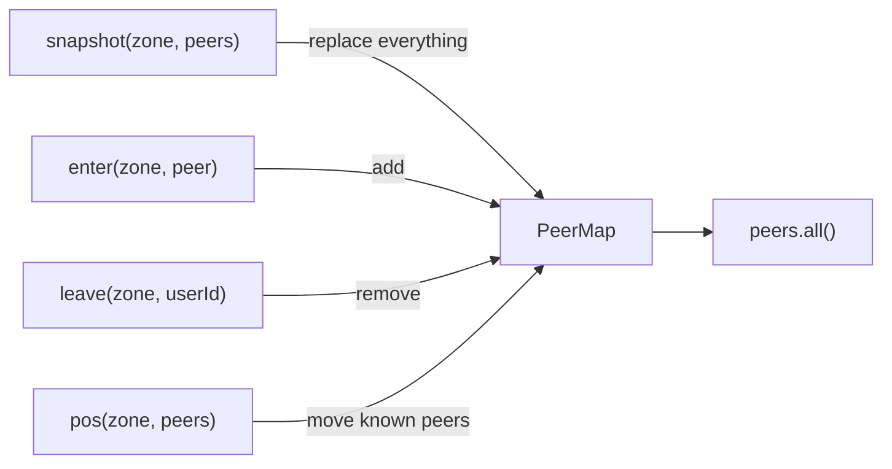
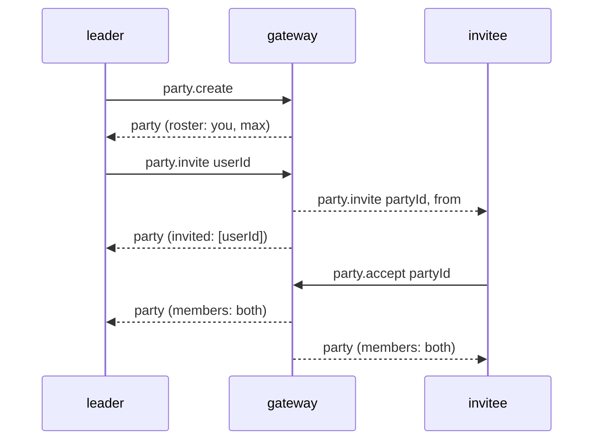

# Lobby

A `lobby` channel routes **scopes**, never semantics: positions and parties have
gateway-side meaning; everything a game invents travels as `event`. This page is
`GatewayLobbyClient` feature by feature.

## Connecting

```dart
final lobby = GatewayLobbyClient(GatewayLobbyClientOptions(url: url, channelId: id, token: jwt));
final hello = await lobby.connect();
```

## `hello` and capabilities

The first frame, always. The client holds no configuration and learns everything here:

| Field | Meaning |
| --- | --- |
| `userId` | you; the token's `sub` |
| `connectionId` | this socket on the gateway |
| `tick` | position flush interval, ms; `peerMoved` fires at most this often |
| `mapUrl` | the immutable map asset; `map()` fetches it |
| `zone` | where the game should start; **you have no zone until your first `pos`** |
| `partyId` | present when the gateway already knows your party (a reconnect) |
| `capabilities` | the channel's config object verbatim |
| `aoi` | the view rule: `maxPeers` always, `range` when the channel has a box |

`lobby.capabilities` is what the senders check: a `pos: false` makes `pos()` throw
`StateError` before anything is sent; a `say` list that lacks `party` makes
`say(scope: SayScope.party)` throw. A field the gateway did not send is treated as
allowed, and the gateway is the enforcement either way.

## Positions and zones

```dart
lobby.pos(zone: hello.zone, x: 3, y: 4, dir: 'n');
```

The first `pos` enters a zone; the gateway answers with a `snapshot`. A `pos` with a
different `zone` is a zone change: `leave` goes to the old zone's viewers, a fresh
`snapshot` to you, `enter` to the new zone's. Whether you *may* enter a zone is your
game's rule — **zones are not private**, and the gateway does not enforce access.

`dir` is your own opaque facing token, at most 16 bytes; an omitted `dir` in a later
`pos` clears it for your peers. Coordinates are `double`; the gateway refuses a jump
over the channel's `maxMoveDelta` with `move_too_far`.

## The peer map

`lobby.peers` is reduced from four frames and is the thing to render from:



Rules the map applies so you do not have to:

- a `snapshot` replaces the map — treat every one as "start over" (a config change or
  a crowd arriving produces one instead of a burst of `enter`/`leave`);
- frames for any other zone are ignored, so a late `pos` from the zone you left
  cannot resurrect a peer;
- your own entry in a `pos` batch is dropped;
- a `pos` or `leave` for a peer you do not know is ignored (the gateway's view
  invariant says it cannot happen; if it does, it is a gateway bug worth logging);
- on `disconnected` the map is emptied; after the next `hello` it stays empty until
  you send `pos` and a `snapshot` arrives.

`snapshots`, `peerEntered`, `peerLeft` and `peerMoved` fire after the map changed; a
`snapshot` that changes nothing still fires `snapshots`.

**Area of interest.** A view holds at most `aoi.maxPeers` nearest peers (default 64,
at most 256), and with `aoi.range` only those inside the box around your last `pos`.
Views are receiver-owned and can be asymmetric — B may see A while A's box is full —
and a peer that walks out of your box gets a `leave` although it never left the zone.
A client that keys by `userId` and applies the four frames needs no change; this one
does.

## Chat

```dart
lobby.say(scope: SayScope.zone, text: 'hello');
lobby.say(scope: SayScope.party, text: 'ready?');
lobby.say(scope: SayScope.user, to: peerId, text: 'psst');
lobby.said.listen((s) => print('${s.from} (${s.scope}): ${s.text}'));
```

`zone` reaches whoever has you in view, plus yourself; `party` your party; `user`
one user, across zones. You hear your own `say` back — filter on `from ==
hello.userId` if you render locally first. `text` is at most 1024 bytes.

## Game events

```dart
lobby.event(scope: SayScope.zone, name: 'cast', payload: {'spell': 'fire', 'at': [3, 4]});
lobby.eventReceived.listen((e) => handle(e.name, e.payload));
```

Same routing as chat; `name` 1–64 bytes, `payload` ≤ 8 KB and unread by the gateway.
A `null` payload is omitted from the frame. `event` is gated by the channel's `event`
flag alone — the `say` scope list does not apply to it.

## Parties

```dart
lobby.party.create();
lobby.party.invite(peerId);
lobby.partyInvited.listen((i) => lobby.party.accept(i.partyId));
lobby.partyChanged.listen((r) => showRoster(r.members, leader: r.leaderId));
```

The flow, from the leader's side:



`lobby.roster` is the latest `party` frame and `lobby.partyId` the current party
(`null` for none). The gateway marshals the roster with `omitempty`; the SDK fills
`leaderId`, `invited`, `members` and `max` in, so `roster.invited.length` needs no
guard. Membership survives a disconnect for 30 minutes and marks you
`online: false` meanwhile; leadership passes to the next member when the leader
leaves; an empty party dissolves. A `party.declined` reaches the leader on
`partyDeclined`.

## The map

```dart
final map = await lobby.map(); // a JSON value, or the text when it is not JSON
```

Fetched from `hello.mapUrl` with no credentials (the asset is public), cached per URL
for the client's life, shared between concurrent calls, and evicted on failure so the
next call retries. A new map version is a new URL in a later `hello`. Bounds: 30 s,
16 MiB, 5 redirects; a body over 64 MiB is a `MapFetchException`, not text.

## Escape hatches

- `lobby.send(frame)` sends any frame object (a `Map<String, Object?>`); the SDK still
  refuses to send outside `connected`.
- `lobby.frames` delivers every frame after `hello`, before any SDK handling, as a
  `LobbyServerFrame` (a `party` frame already filled in; an unknown type as
  `UnknownServerFrame`). `frame.raw` is the map as received.
- `lobby.ping()` → `pong`; the gateway also sends WebSocket pings itself every 30 s.

## Shutting down

`await lobby.close()` in `dispose()`. [Connection lifecycle](connection-lifecycle.md)
says what it emits.
