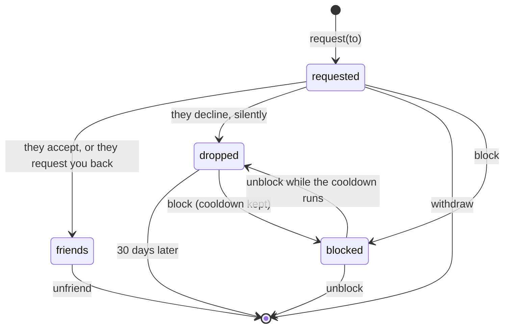

# Friends and blocks

Give players a card, let them ask each other to be friends, and let them block,
with the channel JWT the game already holds. `yingyeothon_social_client` implements
it; the graph itself belongs to the [`service`](https://github.com/yingyeothon/service)
repository (`services/state/README.md`, _Social routes_, and `docs/social.md`), which
is right when this page disagrees.

## The shape of it

Social is scoped to the **auth channel**, not to the project: a project running two
auth channels has two friend graphs, because a player id is derived per channel
and means nothing outside it. Two things make up the graph:

| Thing | What it is | Who writes it |
| --- | --- | --- |
| a **card** (`SocialProfile`) | `displayName` (1 … 32 characters, not unique) and an optional `avatar` (an id or a path into your own asset table, never a URL) | the player, for its own; the game server's key, for anyone, a guild included |
| a **relation** | one row per direction in one of four states: `requested`, `dropped`, `friends`, `blocked` | the players; the server key only deletes |

A card admits a player to the graph: both ends of a request or a friendship must
hold one (`409 profile_required`), which is what bounds the table. **A block is
the exception** — it may name any player id, since the id of somebody worth
blocking usually comes from the lobby roster. Caps per player: 200 friends, 100
requests each way, 500 blocks.



## The case the playground shows

Set a card, ask a player id, accept what waits, read the friends list with their
cards folded in:

```dart
import 'package:yingyeothon_social_client/yingyeothon_social_client.dart';

final social = SocialClient(SocialClientOptions(
  baseUrl: Uri.parse('https://doc.yyt.life'), // the key-value store's host
  token: token.jwt,
));

await social.putMyProfile('Alice', avatar: 'heroes/mage'); // whole; absent avatar clears
final sent = await social.request(peerUserId);   // requested, or friends at once
final waiting = (await social.requests()).incoming;
for (final r in waiting) {
  await social.accept(r.owner);
}
final friends = await social.friends();          // SocialRelation: owner, card, since
```

The ids come from the lobby (`Peer.userId`, `hello.userId`) or from your own
store; `profiles(ids)` confirms up to 50 of them and never lists. A friends,
requests or blocks row carries the other player's card already, so a list is one
request, not one per row.

## What the players cannot see

- **A decline is silent.** The sender's row becomes `dropped`: out of the
  recipient's inbox, still charged to the sender's outgoing cap for 30 days, and
  shown to the sender exactly like a pending request. A re-request writes nothing;
  `withdraw` refuses it (`404`), since withdrawing would clear the cooldown — so a
  `404` from `withdraw` on a row your own list shows means "declined; leave it",
  not a bug to retry.
- **A block answers `404`, and so does a target with no card.** `request` to
  somebody who blocked you, who never played, or who holds no card is one answer
  (`isNotFound`). It is not proof — a caller who knows a target has a card can
  still infer a block — and `profiles` does not hide a blocker's card either.
- **A block drops their row to you** when it was a request or a friendship, never
  their own block of you; an unblock brings a cooldown back as `dropped` and never
  restores a friendship. Two players who declined each other each see a pending
  request the other never will, until both expire; that is deliberate.
- **Deleting your card** takes your relations in both directions with it, except
  somebody else's block of you: that row is theirs.

## What the server key does

The auth channel's doc apiKey (a game server, a Lambda — never a key shipped inside
the app) reads any player's friends (`server.friendsOf`), writes and deletes cards
for anyone (`server.putProfile`, `server.deleteProfile`; the owner may be a guild,
`kind:id`), and deletes relations (`server.deleteRelations(player, other:)`) — the
moderation tool that keeps "delete the channel" from being the only answer to an
abuse report. It never creates a relation: a server that could make a friendship
could forge consent. A player's `me` routes from a server key are a `403`.

## Presence is the gateway's

Who is online is not in this SDK: the gateway's `GET /presence?channel=&users=`
(its README, _Presence_, in the `service` repository) answers for up to 50 ids of
the lobby's auth channel to any member's JWT; call it with `package:http` and join
the answer to your friends list. It is not block-aware and cannot be: a player you
blocked keeps a working presence feed on you for any id they already hold. Online
means a session key exists, refreshed on traffic with a 15-minute life, so a
departed player reads as online for a while; a hint for a list, never an input to
an authorization decision.

## Refusals

| Status | `SocialException` | Why you would hit this |
| --- | --- | --- |
| `404` | `isNotFound` | no card (`myProfile()` folds it into `null`); on `request`, the target has no card, blocked you, or does not exist; on `withdraw`, the request was declined (leave it); on `accept`, `decline`, `unfriend`, `unblock`, no such row |
| `409` | `isProfileRequired` | you asked, accepted or blocked without a card of your own |
| `409` | `isBlocked` | you asked somebody you blocked; unblock first |
| `409` | `isFull` | `friends_full` / `peer_friends_full`, `pending_full` / `peer_pending_full`, `blocks_full`, `channel_full` (10 000 cards); `reason` says which |
| `403` | `isForbidden` | a server key on a `me` route, a player on `server.*`, or a token whose subject is not a player id (a game may mint others; they have no place in the graph) |
| `400` | `isBadRequest` | yourself as the other end |
| `401` | `isUnauthorized` | the token is missing, expired or not for this stage |

A local `ArgumentError` comes first for what the client can know: a player id that
is not 32 hex, a display name or avatar the server would refuse, more than 50 ids
([Errors](errors.md)). The message names the rule, never the input. Before showing
a display name from the wire, remember it is another player's text: the server
refuses controls, format characters and line separators on write, but not every
look-alike or blank, so show it only when it passes your own label check and let
the owner id stand in otherwise, as the example's Friends screen does with
`MapLayout.isLabel` (`examples/playground/lib/map_layout.dart`).

## Browser builds

Plain HTTPS through `package:http`, like the key-value store: it runs on web
without configuration, and the state stack's CORS policy already admits any
origin.
