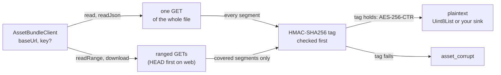

# yingyeothon_asset_client

A reader for yyt asset bundles on the CDN (`https://d.yyt.life/assets/{bundleId}/`,
`https://dev-d.yyt.life` on dev): a whole file, a JSON manifest, a byte range, or a
resumable download into a sink you provide or straight to a file. With the bundle's
key it reads an encrypted bundle, whose files the CDN serves as `yyt-enc v1`
ciphertext, and verifies every 64 KiB segment before releasing a byte of it; without
a key it reads a plain bundle through the same calls. Pure Dart — web included — with
one `http.Client`; it never logs, throws or returns a message that contains the key,
a URL or a byte of plaintext, and a path appears only as a sanitised log field. The format is specified in the `service`
repository's `docs/asset-encryption.md`, and [the guide page](../../docs/assets.md)
covers bundle shapes and the manifest pattern.

Every read maps a path to one URL below `baseUrl`; a keyed client decrypts what comes
back, segment by segment, and refuses anything whose tag fails:



## Install

```yaml
dependencies:
  yingyeothon_asset_client:
    git:
      url: https://github.com/yingyeothon/flutterlib.git
      path: packages/yingyeothon_asset_client
      ref: v0.1.0
```

## Usage

```dart
import 'package:yingyeothon_asset_client/yingyeothon_asset_client.dart';

final bundle = AssetBundleClient(AssetBundleClientOptions(
  baseUrl: 'https://d.yyt.life/assets/bnd_123/', // a live bundle; add 'v3/' for a version
  key: bundleKey, // 'yak1.…' from `yyt asset key show <bundle>`; omit for a plain bundle
));

final manifest = await bundle.readJson('manifest.json'); // a mutable file
final db = await bundle.read('data/songs.db');            // one file, whole
final intro = await bundle.readRange('music/intro.ogg', start: 0, end: 65536);

try {
  await bundle.read('data/missing.db');
} on AssetClientException catch (e) {
  if (e.code != AssetClientErrorCode.notFound) rethrow;
  // an app older than the bundle: ask for an update
}
```

A large file goes straight to disk, resuming where it stopped (`dart:io` only; this
library re-exports the core, so it is the one import):

```dart
import 'package:yingyeothon_asset_client/yingyeothon_asset_client_io.dart';

await downloadToFile(bundle, 'music/album.ogg', '${dir.path}/album.ogg',
    onProgress: (p) => print('${p.written} of ${p.total}'));
```

One client per bundle, kept for as long as the app reads it: `close()` zeroes the key
and ends every read in flight with a `StateError`, so call it when the app is done
with the bundle, not from a widget that merely shows it.

## Base URL and paths

`baseUrl` is `https://{cdn}/assets/{bundleId}/` for a live bundle and
`https://{cdn}/assets/{bundleId}/{version}/` for one version of a versioned bundle;
the trailing slash is optional, and `yyt asset files <bundle>` prints every file's
public URL. A file's associated data — what its ciphertext is bound to — is its
object key below the bundle: `{path}` in a live bundle and `{version}/{path}` in a
versioned one. The client derives it from `baseUrl` and `path`, and a keyed client
refuses a `baseUrl` of neither shape with an `ArgumentError` at construction.

**`baseUrl` is the bundle or the version, never a folder inside it.**
`…/assets/bnd_123/music/` has the shape of version `music` of a versioned bundle, so
every read of a live bundle through it fails as `asset_corrupt`; put the folder in
`path` instead. The same bytes served under another path, version or bundle fail the
same way, exactly like a wrong key.

A `path` is segments separated by `/`, with no leading slash, no empty, `.` or `..`
segment, no backslash, no control character and no lone UTF-16 surrogate. Each
segment is percent-encoded into the URL and bound as raw UTF-8, so a non-ASCII path
works as the CLI uploaded it.

## The key

`key` is the text `yak1.` + 43 base64url characters, exactly as `yyt asset key show
<bundle>` prints it, or its 32 raw bytes as a `Uint8List`. A text that is not
canonical — another prefix, padding, `+` or `/`, or a last character outside
`AEIMQUYcgkosw048` that would decode to the same bytes — is refused with `bad_key`, so
a lenient and a strict decoder can never disagree on what a key is. The client copies
the key at construction; `close()` zeroes that copy and every derived key the client
still holds, and each read zeroes its own on the way out. Dart gives no guarantee
beyond that: the garbage collector may have moved bytes before they were zeroed, the
canonicality check makes a `String` copy nothing can zero, and the AES key schedule
and the HMAC pads are pointycastle's own.

**Omitting `key` for an encrypted bundle is not an error.** The client then reads a
plain bundle and returns the ciphertext as it was served; only `readJson` notices, as
`asset_corrupt`.

## Reads

What each call of a keyed client puts on the wire, and what it holds:

| Call | `corsSafe: false` | `corsSafe: true` | Holds in memory |
| --- | --- | --- | --- |
| `read` / `readJson` | one `GET` | one `GET` | the file twice: cipher and plain |
| `readRange` starting in segment 0 | one ranged `GET` | `HEAD`, one ranged `GET` | the covered segments |
| `readRange` starting after it | header `GET`, one ranged `GET` | `HEAD`, header `GET`, one ranged `GET` | the covered segments |
| `download` from the start | one ranged `GET` (`bytes=0-`) | `HEAD`, one ranged `GET` | one 64 KiB segment |
| `download` resumed past segment 0 | header `GET`, one ranged `GET` | `HEAD`, header `GET`, one ranged `GET` | one 64 KiB segment |

A plain bundle makes one request per call: a `GET` for `read` and a fresh `download`,
one ranged `GET` for `readRange` and a resumed `download`.

`readRange(path, start:, end:)` takes plaintext offsets, `end` exclusive and optional
(to the end of the file), and clamps to the file. An empty window (`end <= start`)
returns at once without a request. A window that is empty only after clamping — past
the end of the file — still fetches and verifies the last segment, because the length
the host states is not authenticated until that segment's tag holds.

Every read takes `noCache`, which sends `Cache-Control: no-cache` — unless
`corsSafe` is on, since in a browser the header needs a preflight the CDN refuses. A
mutable file (a manifest) is served `no-cache` by the CDN, so a client with an HTTP
cache already revalidates it; `dart:io`'s client has no cache at all.

`responseTimeout` (30 s) bounds the wait for each response's headers, with any
`http.Client`, and `bodyIdleTimeout` (30 s) each wait for the next piece of a body —
a connection that went quiet, as when a phone changes networks, ends as `network`
rather than hanging. A plain body larger than any asset the platform accepts (the
ciphertext ceiling, 268,566,664 bytes) is refused as `http`; a keyed one fails its
length rules first, as `asset_corrupt`.

## Downloads and resume

`download(path, sink:, resume:, onProgress:)` writes plaintext into an `AssetSink`:
`write(chunk)` gets the next bytes in order and is awaited before the next piece, and
`reset()` means everything written so far must go, because the object is not the one
those bytes came from. In a keyed client each chunk is one verified segment (the
first chunk of a resume is the rest of its segment), so nothing reaches the sink
before its tag verified.

`resume: AssetResume(offset:, etag:)` continues from the segment holding `offset`, so
it re-fetches at most one segment, and only while the object still has that ETag; any
other object calls `reset()` and starts from byte 0. A keyed resume that was already
complete still verifies the last segment and writes nothing. A plain resume at the
end of the file finishes on the host's `416` under a matching `If-Range`; in a
browser, which can send no `If-Range`, it starts over, and so does a plain resume
past the end — a plain file's length is not authenticated, so only a keyed resume
past the end is your `ArgumentError`.

`onProgress(AssetDownloadProgress(written, total, etag))` fires after every piece,
and once for a download that wrote nothing. A plain file whose length the client
cannot trust reports no `total`: a compressed body, and in a browser any whole-file
answer. Whatever the sink or `onProgress` throws ends the download, releases the
connection and reaches you unchanged — that is also how to cancel one from the UI
(throw from `onProgress`); a stalled body ends by itself after `bodyIdleTimeout`.

`downloadToFile` in `yingyeothon_asset_client_io.dart` is that recipe for a file;
its doc comment says what it writes where and how it resumes. **The file is the
plaintext, decrypted**: put it in the app's private storage. Run one call per
destination at a time, and delete the two side files to give up on a download. It
is a separate library because a `part` of the core would share its `dart:io` import
and stop the core compiling for web.

## Browsers and `corsSafe`

The yyt CDN answers `access-control-allow-origin: *`, exposes only `ETag` and
`Content-Length` to scripts, and answers a CORS preflight (`OPTIONS`) with `403`. A
browser therefore cannot read `Content-Range`, and a request carrying `If-Range` never
leaves it. With `corsSafe: true` the client sends no header but `Range` (safelisted
for a single `bytes=` range by the Fetch standard), learns the length and the ETag
from a `HEAD`, and compares each `206`'s ETag with it. A browser that still preflights
`Range` makes the ranged request fail right after its `HEAD` succeeded; the client
then logs `asset ranged request refused; reading the whole file` at `warn` and reads
that file with one plain `GET`, dropping the segments before the window unreleased.
`corsSafe` defaults to `true` on web and `false` elsewhere.

With `corsSafe: false` the client does what the `yyt` CLI does: it reads the total
length from `Content-Range` and sends `If-Range` with the first answer's strong ETag,
and a `206` without a numeric total is an `http` error.

## When the object changes under a read

A mutable file can be replaced between two requests of one read. A `200` to a request
that carried `If-Range`, another ETag, another total length, or — without `If-Range`
— a `206` that names no ETag means exactly that, and the read starts over from the
length and the header, up to three restarts; a fourth change is an `http` error. **A
`200` to a ranged request that carried no `If-Range` and names the same object means
the host ignores `Range`**, which an encrypted read cannot work around: `http`, at
once. A host that sends no ETag at all is still read, but only the tags then tell two
objects apart, so a change mid-read fails as `asset_corrupt` instead of starting
over — the one `asset_corrupt` a retry can cure.

## Errors

Every failure the CDN, the network or the ciphertext causes is an
`AssetClientException` with a `status` (HTTP, `0` when there was no answer), a `code`
from `AssetClientErrorCode` and sometimes a `detail`, a fixed SDK phrase. Its
`toString()` is `AssetClientException(<code>, status <status>)`, with the detail after
a colon, and never a key, a URL, a path or a byte of plaintext.

| `code` | When |
| --- | --- |
| `bad_key` | the key is not the canonical `yak1.` text or 32 bytes (thrown at construction) |
| `not_found` | `403` or `404`. **A missing object answers `403` on the yyt CDN**, so the two are one case |
| `asset_corrupt` | a length no ciphertext has, a failed tag, a wrong key, path or version, or `readJson` on bytes that are not UTF-8 JSON |
| `http` | any other status, a host that ignores `Range`, a `206` that is not the range asked for, an object that kept changing, a plain body larger than any asset |
| `network` | no answer, or none within `responseTimeout` (no transport error message crosses), or a body that failed, stalled past `bodyIdleTimeout`, ended early or ran past its stated length |

Local misuse — a malformed `baseUrl` or path, a negative offset, an empty resume
ETag — is an `ArgumentError` before any request. The one `ArgumentError` that comes
after requests is a resume offset past the end of the file, raised once the last
segment verified, so a truncated file cannot be blamed on you. A call on a closed
client is a `StateError`, and so is a read that was in flight when it closed — keyed or
plain, whether the client's `http.Client` is its own or yours — at its next piece, or
when the quiet connection it waits on times out.

## Security

Log lines are `asset request` at `debug` with `{kind, path, status, range?}` — `kind`
is `whole`, `head`, `header`, `segments` or `range`, and `path` is capped at 64
characters with control, format and bidi characters replaced, since a manifest (and so
the CDN) may have chosen it — `asset request failed` at `warn` with `{kind, path}`, `asset ranged request refused; reading the whole file` at `warn`
with `{path}`, and `asset changed during a read; starting over` at `info` with `{path,
restart}`. None carries the key, a URL or a byte of the body, nor a transport
error's text. The tag is compared in constant time
(every byte XOR-accumulated) before a byte of its segment is decrypted. Every
response body the client does not read to the end is cancelled, on success and on
failure, so a refused answer never keeps its connection.

## The crypto

`package:pointycastle`, pure Dart, so the same code runs on the VM and on web:
HMAC-SHA256 through `HMac`, HKDF-SHA256 on top of it, and AES-256 through `AESEngine`
driven by a CTR loop of the client's own in which only the IV's last 4 bytes count,
big-endian, exactly as the format specifies (a segment is at most 4,096 blocks, so
they never wrap). `package:cryptography` was the alternative; its CTR counter width
is not specified where it matters here, so it would have needed its own proof against
the vectors. The service repository's conformance vectors — every positive case
whole and by ranges across every segment boundary, every negative case
`asset_corrupt` — run in both request modes.

## What this does not do

No upload, no encryption, no listing: `yyt asset sync` is the only encryptor, and the
console owns the bundle's file list. No cache of its own, no retry of a `network`
failure (resume instead), no key rotation.

## Public API

- `AssetBundleClient` (`read`, `readJson`, `readRange`, `download`, `close`) and
  `AssetBundleClientOptions` (`baseUrl`, `key`, `corsSafe`, `client`, `logger`,
  `responseTimeout`, `bodyIdleTimeout`, `effectiveCorsSafe`).
- `AssetSink`, `AssetResume`, `AssetDownloadProgress`, `AssetDownloadResult`.
- `AssetClientException`, `AssetClientErrorCode`.
- `yingyeothon_asset_client_io.dart`: `downloadToFile`, and the core re-exported.

## Differences from @yingyeothon/asset-client and Yingyeothon.AssetClient

- One vocabulary with tslib — the same calls, codes, log lines and request plans —
  adapted to Dart: named parameters instead of option objects; an
  `AssetClientException` class where tslib has an `AssetClientError` class (with a
  duck-typed `isAssetClientError`), and its `toString()` is `AssetClientException(code,
  status N)` rather than `asset <code> (<status>)`; `ArgumentError`/`StateError` for
  local misuse where tslib uses `RangeError`/`Error`.
- `readJson` returns `Object?` rather than a caller-typed `T`, and decodes with
  `yingyeothon_codec`: a document over 64 Mi characters or nested deeper than 64 is
  `asset_corrupt`, where `JSON.parse` would take it. A byte-order mark is dropped, as
  `TextDecoder` does.
- The transport is an `http.Client`, not an injected `fetch` with its own types.
- `corsSafe` defaults from the compile target (`dart.library.js_interop`), not from a
  run-time `document`/`WorkerGlobalScope` check; set it yourself inside a WebView.
- `noCache` instead of the fetch `cache` mode, which `package:http` has no equivalent
  of; it is never sent in CORS-safe mode.
- `responseTimeout` and `bodyIdleTimeout`; tslib has neither and relies on the sink
  to abort. A plain body over the asset ceiling is `http`; tslib reads it whole.
- Crypto is pure Dart (pointycastle), so no secure context is needed on web and
  `bad_key` never means "WebCrypto refused the key"; the key cannot be made
  non-extractable, so the client zeroes its own copies instead.
- A file download ships as `downloadToFile` in a separate `dart:io` library; tslib
  leaves the file sink to a documented recipe.
- The C# client in `csharplib` is planned to follow the same shape; it does not exist
  yet.
