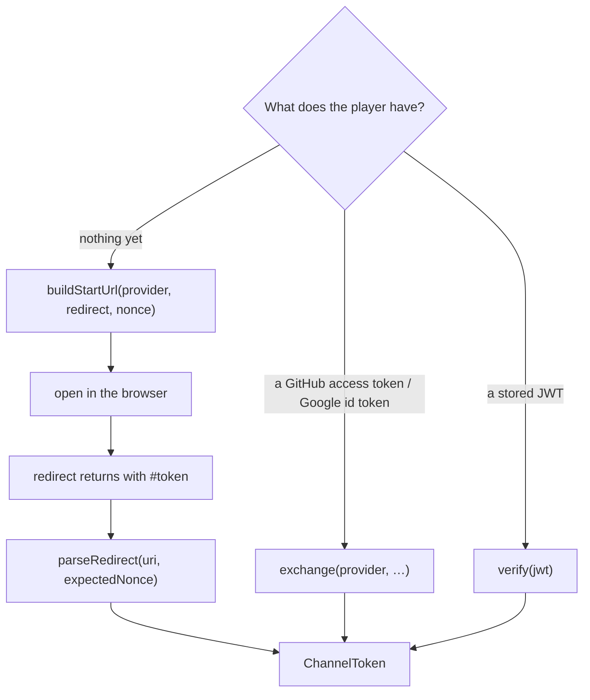

# yingyeothon_auth_client

The client's half of getting a yyt channel JWT. One `AuthClient` per auth channel: it
reads the channel's public config, builds the browser sign-in URL with a nonce, parses
the redirect that comes back, exchanges a provider credential directly, and verifies a
token. Opening the browser, receiving the redirect and storing the token are the
app's job — this package has no platform dependency and never logs, throws or returns
a message that contains a token.

Which call you make depends on what the player already has:



## Install

```yaml
dependencies:
  yingyeothon_auth_client:
    git:
      url: https://github.com/yingyeothon/flutterlib.git
      path: packages/yingyeothon_auth_client
```

## Usage

```dart
import 'package:yingyeothon_auth_client/yingyeothon_auth_client.dart';

final auth = AuthClient(
  baseUrl: Uri.parse('https://auth.yyt.life'),
  channelId: 'auth_0123456789abcdef',
);

// Browser flow: the app opens the URL and receives the redirect (deep link, loopback
// server, or the page itself on web).
final nonce = AuthClient.newNonce();
final start = auth.buildStartUrl(
  provider: 'github',
  redirect: Uri.parse('https://game.example/signin'), // must be on the channel's allowlist
  nonce: nonce,
);
// ... later, with the URI the browser came back to:
final token = auth.parseRedirect(returned, expectedNonce: nonce);
// discard `returned` now: its fragment is the credential

// Native flow: one request, no browser.
final token2 = await auth.exchange(provider: 'github', accessToken: providerToken);

// A stored token: still valid?
final stillValid = await auth.verify(token.jwt); // null on 401
```

`token.jwt` is the value for `GatewayClientOptions.token`. The token lives for the
channel's `tokenTtlSec` (24 h by default); **there is no refresh** — sign in again.

## Failures

`AuthFailure(kind, status)` — `httpStatus`, `notJson`, `missingField`,
`nonceMismatch`, `missingFragment`, `network`. The body of a failed response may
quote the credential back, so the status is the whole report.

## Public API

- `AuthClient` (`fetchConfig`, `buildStartUrl`, `parseRedirect`, `exchange`, `verify`,
  `newNonce`).
- `AuthChannelConfig`, `ChannelToken`, `AuthFailure`, `AuthFailureKind`.

## Differences from @yingyeothon/lambda-authorizer and the csharplib SignIn sample

- tslib's authorizer packages are the *server* half (verifying a bearer on API
  Gateway) and are not ported. csharplib kept sign-in as a sample outside the SDK.
  Here it is a package, because a Flutter app's default path is the browser redirect,
  and nonce checking, fragment parsing and "never log the body" are exactly the code a
  game copies wrong.
- The nonce rides in the redirect's query string; the auth service matches the
  allowlist on origin and path prefix, so a query is admitted.
