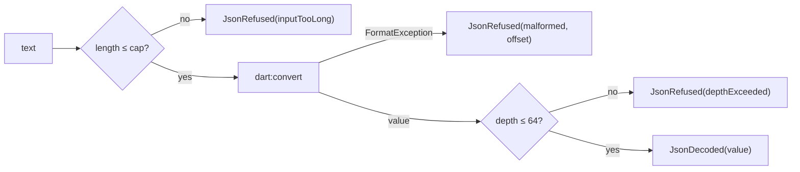

# yingyeothon_codec

Bounded JSON decoding and encoding for a client that reads from a network peer.
`dart:convert` does the parsing; this package adds a length cap checked before a
character is parsed, a depth cap, a non-throwing entry point, failures that carry a
code and an offset but never a quote of the input, and a builder that keeps "absent"
and "JSON null" apart.

Every text goes through the same three gates before a value comes out:



## Install

```yaml
dependencies:
  yingyeothon_codec:
    git:
      url: https://github.com/yingyeothon/flutterlib.git
      path: packages/yingyeothon_codec
```

## Usage

```dart
import 'package:yingyeothon_codec/yingyeothon_codec.dart';

switch (Json.tryDecode(text)) {
  case JsonDecoded(:final value):
    final frame = value as JsonObject;
    print(frame.getString('type'));
  case JsonRefused(:final failure):
    print(failure); // "malformed at 17" — never the text
}

final frame = Json.object()
    .set('type', 'pos')
    .set('dir', null)      // omitted
    .setNull('payload')    // written as null
    .build();
final wire = Json.encode(frame);
```

## What the bounds are

| Bound | Value | Why |
| --- | --- | --- |
| `Json.maxLength` | 1 MiB of characters | a gateway frame is under 32 KiB; anything larger is not a frame |
| `Json.maxBigLength` | 64 MiB | a map asset, through `tryDecodeBig` |
| `Json.maxDepth` | 64 | on decode and on encode; checked iteratively |

`FormatException.toString()` quotes a window of the input. A refusal here is a
`JsonParseFailure` whose `toString()` is `"<error> at <offset>"`, and the test suite
asserts equality with that template so nothing from the input can leak through a log.

## Public API

- Entry points: `Json` (`tryDecode`, `tryDecodeBig`, `decode`, `encode`, `object`,
  `depthOf`, `maxLength`, `maxBigLength`, `maxDepth`).
- Results: `JsonDecodeResult`, `JsonDecoded`, `JsonRefused`, `JsonParseFailure`,
  `JsonParseError`.
- Errors: `JsonParseException`, `JsonDepthError`, `JsonEncodeError`.
- Shapes: `JsonObject`, `JsonList`, `JsonObjectBuilder`, and the `JsonReading`
  extension (`has`, `getString`, `getNumber`, `getInt`, `getDouble`, `getBool`,
  `getObject`, `getListOrEmpty`).

## Differences from @yingyeothon/codec and Yingyeothon.Codec

- No hand-written parser. csharplib wrote one for IL2CPP; Dart has `dart:convert` on
  every platform, so this package only bounds it. The price is a coarser error: three
  kinds (`inputTooLong`, `depthExceeded`, `malformed`) instead of csharplib's nineteen.
- No `Codec<T>` interface. `dart:convert` already owns that name, and Dart has no use
  for a generic encode without reflection. Callers use the static `Json` API.
- `JsonReading` is an extension on `Map<String, Object?>` rather than a value type:
  the decoded map is the value tree, and `has()` is how absent is told from null.
