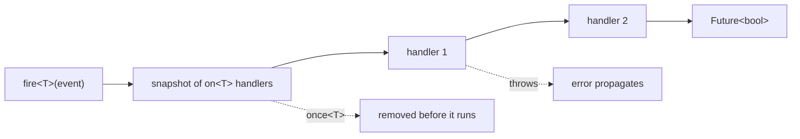

# yingyeothon_event_broker

A type-keyed asynchronous event broker: subscribe by the payload's static type
(`on<PlayerDied>`), fire, and await every handler in registration order. A misspelt
event is a compile error, not a silent no-op. It stands alone — no other package
depends on it — and is here for a game's own event bus.

`fire` walks a snapshot of the handlers, one at a time, and stops at the first throw:



## Install

```yaml
dependencies:
  yingyeothon_event_broker:
    git:
      url: https://github.com/yingyeothon/flutterlib.git
      path: packages/yingyeothon_event_broker
```

## Usage

```dart
import 'package:yingyeothon_event_broker/yingyeothon_event_broker.dart';

class PlayerDied {
  const PlayerDied(this.userId);
  final String userId;
}

final broker = EventBroker()
  ..on<PlayerDied>((e) => print('${e.userId} died'))
  ..once<PlayerDied>((e) async => await showBanner(e));

final handled = await broker.fire(const PlayerDied('u1')); // true
```

**The key is the static type argument**: `fire<Base>(derived)` reaches `on<Base>`
handlers, not `on<Derived>` ones. Handlers run one at a time over a snapshot taken when
`fire` is called; the first that throws stops the fire and the error propagates.

## Public API

- `EventBroker` (`fire`), `EventListenable` (`on`, `once`, `off`), `EventHandler`.

## Differences from @yingyeothon/event-broker and Yingyeothon.EventBroker

- Type-keyed like csharplib, not string-keyed like tslib: Dart generics are reified,
  so `on<T>` is cheap and the compiler checks the name.
- `T extends Object`, so a `dynamic` registration is refused at compile time.
