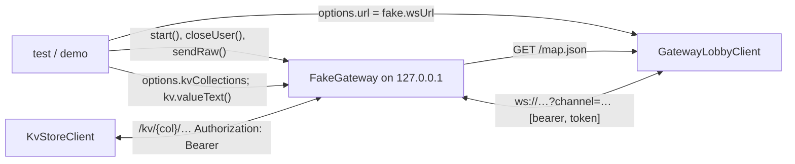

# yingyeothon_fake_gateway

An in-process stand-in for the yyt realtime gateway, for the SDK's integration
tests and the example app's offline demo. It speaks the lobby and `q` wire protocols
closely enough to drive `yingyeothon_gamebase_client` end to end over the real
transport: the bearer subprotocol handshake, `hello`, zones and the peer-map frames,
chat and events by scope, parties with the gateway's `omitempty` marshalling,
`ping`/`pong`, the documented refusal codes, and the close codes a test injects. The
same listener serves the state stack's `/kv/*` routes over an in-memory store, so
`yingyeothon_kvstore_client` and the example's key-value screen run offline too.
**It is not the gateway** — no rate limiting, no area of interest, no persistence, no
token verification — and it is `publish_to: none`.

A test (or the demo) owns both ends of the socket:



## Install

Only as a dev dependency inside this repository; `yingyeothon_fake_gateway` is never
published and imports `dart:io`, so it cannot run on web.

```yaml
dev_dependencies:
  yingyeothon_fake_gateway: ^0.1.0   # workspace-resolved
```

## Usage

```dart
import 'package:yingyeothon_fake_gateway/yingyeothon_fake_gateway.dart';
import 'package:yingyeothon_gamebase_client/yingyeothon_gamebase_client.dart';

final gw = await FakeGateway.start();
final client = GatewayLobbyClient(GatewayLobbyClientOptions(
  url: gw.wsUrl.toString(),
  channelId: 'lobby_0123456789abcdef',
  token: 'alice', // any non-empty token; its text (or its JWT `sub`) is the user id
));
await client.connect();
await gw.closeUser('alice', 4002); // the SDK reconnects
await gw.shutdown();
```

Identity comes from the token: a JWT-shaped token yields its `sub`, anything else is
its own user id, so two clients with tokens `alice` and `bob` see each other.

The key-value routes need collections, declared the way the console would create
them; a token starting with `yds.` is the game server (the fake checks only the
prefix; the service verifies the key and binds it to a project), anything else a
player whose user id — and therefore whose `owner` in every listing row — is the
token text itself:

```dart
final gw = await FakeGateway.start(
  options: const FakeGatewayOptions(
    kvCollections: <FakeKvCollection>[
      FakeKvCollection(name: 'announcements', readScope: 'project', writeScope: 'team',
          entries: <String, Object?>{'2026-09-01': <String, Object?>{'title': 'Welcome'}}),
      FakeKvCollection(name: 'profile', readScope: 'user', writeScope: 'user'),
    ],
  ),
);
final kv = KvStoreClient(KvStoreClientOptions(baseUrl: gw.kvUrl, token: 'alice'));
await kv.collection('profile').mine.put('settings', {'volume': 0.5});
gw.kv.valueText('profile', 'settings', owner: 'alice'); // '{"volume":0.5}'
```

## Public API

- `FakeGateway` (`start`, `wsUrl`, `mapUrl`, `kvUrl`, `kv`, `port`, `lobbyUsers`,
  `gameMembers`, `received`, `closeUser`, `sendRaw`, `sendBinary`, `shutdown`).
- `FakeGatewayOptions` (`acceptedTokens`, `tick`, `capabilities`, `partySizeMax`,
  `defaultZone`, `mapDocument`, `onGameFrame`, `maxPeers`, `kvCollections`),
  `GameFrameHandler`, `GameSession`.
- `FakeKvCollection` (`name`, `id`, `readScope`, `writeScope`, `encrypted`,
  `maxEntries`, `maxEntriesPerOwner`, `entries`, `ownerEntries`), `FakeKvStore`
  (`valueText`, `handles`, `handle`).

## Differences from the tslib gateway-contract example

- tslib's `examples/gateway-contract` fakes the gateway inside one process for a
  contract test; this is a real loopback server, so the `web_socket_channel`
  transport, the handshake and the close codes are exercised for real.
- The `q` side has no actor: by default it echoes every frame as
  `{"type":"echo","of":…}`; `onGameFrame` scripts anything else.
- The kv store follows `services/state`'s routes (scopes, both namespaces, versions
  that keep climbing, conditional writes, TTL, `incr`, cursors, the `409` reasons)
  (a version survives expiry, not a delete) but admits any plain segment as an owner id, because its identities are token
  texts rather than 32-hex user ids, and stores values in the clear whatever
  `encrypted` says.
