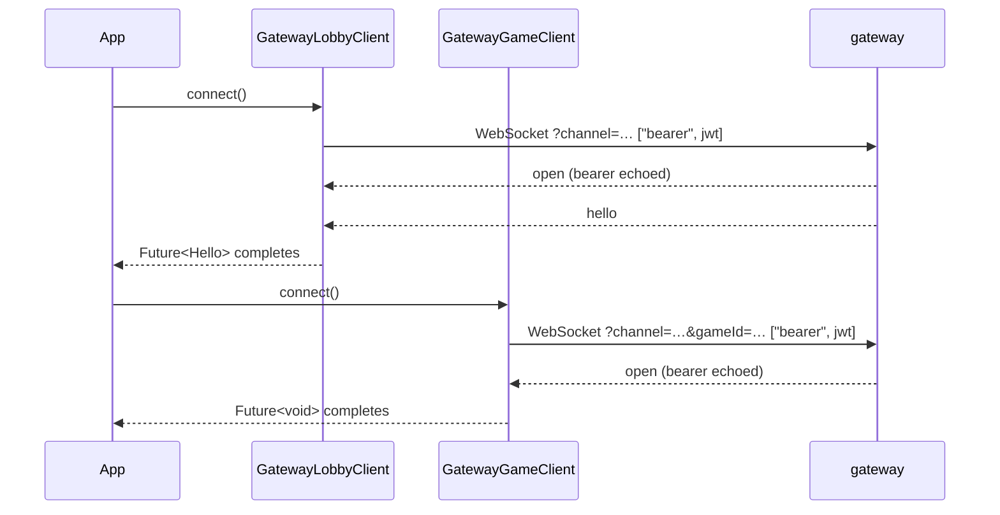

# yingyeothon_gamebase_client

Client SDK for the yyt realtime gateway. Two clients over one connection state
machine: `GatewayLobbyClient` for a `lobby` channel (positions, chat, parties, the
map) and `GatewayGameClient` for a `q` channel (a dungeon run bridged to your game
actor). Reconnect with backoff, the gateway's close-code policy, a peer map kept from
`snapshot`/`enter`/`leave`/`pos`, and a token that only ever travels in the WebSocket
subprotocol list. The normative wire spec is the gateway's README in the `service`
repository; this package follows it.

Both clients share the state machine; they differ in what "connected" means:



## Install

```yaml
dependencies:
  yingyeothon_gamebase_client:
    git:
      url: https://github.com/yingyeothon/flutterlib.git
      path: packages/yingyeothon_gamebase_client
```

`yingyeothon_codec` and `yingyeothon_logger` are path dependencies inside the same
checkout and come with it. Works on Android, iOS,
desktop and web through `package:web_socket_channel`.

## Usage

```dart
import 'package:yingyeothon_gamebase_client/yingyeothon_gamebase_client.dart';

final lobby = GatewayLobbyClient(GatewayLobbyClientOptions(
  url: 'wss://gw.yyt.life',
  channelId: 'lobby_0123456789abcdef',
  token: channelJwt,
));

lobby.snapshots.listen((s) => render(lobby.peers.all()));
lobby.peerMoved.listen((moved) => render(lobby.peers.all()));
lobby.said.listen((say) => chat.add('${say.from}: ${say.text}'));
lobby.stopped.listen((e) => showEnd(e.reason));

final hello = await lobby.connect();      // throws GatewayStoppedException if it never gets there
lobby.pos(zone: hello.zone, x: 0, y: 0);  // the first pos enters the zone; a snapshot follows
lobby.say(scope: SayScope.zone, text: 'hi');

await lobby.close();                      // in dispose()
```

The dungeon client is a passthrough — every frame is your game's:

```dart
final game = GatewayGameClient(GatewayGameClientOptions(
  url: 'wss://gw.yyt.life', channelId: 'q_0123456789abcdef', gameId: gameId, token: channelJwt,
));
game.frames.listen((frame) => apply(frame));
game.aborted.listen((e) => backToLobby('the server stopped responding'));
game.finished.listen((e) => showResult());
await game.connect();
game.send({'type': 'move', 'dx': 1});
```

The guide covers each feature: [Lobby](../../docs/lobby.md),
[Dungeon](../../docs/dungeon.md), [Connection lifecycle](../../docs/connection-lifecycle.md),
[Errors](../../docs/errors.md).

## What the SDK decides for you

| Close code | Meaning | The client |
| --- | --- | --- |
| `4000` | replaced by a newer socket of yours | stops |
| `4001` | `q`: the actor stopped consuming | `aborted`; retry with a new `gameId` |
| `4002` | idle: no pong in 75 s | reconnects |
| `4003` | 50 refused messages on one socket | stops (`clientBug`) |
| `4004` | the channel expired or was disabled | stops |
| `4005` | too slow; the outbound queue filled | reconnects (a fresh `snapshot` resyncs) |
| `1000` | `q`: the game dropped you, a normal finish | `finished`; lobby: stops |
| `1001` | gateway restarting | reconnects with backoff |
| `1003`, `1009` | you sent a binary frame / a frame over 16 KB | stops (`clientBug`) |
| `4900` | the SDK cut an inbound text frame over 64 KiB; never sent by the gateway | reconnects |
| `1011` | `q`: the enter push failed | reconnects |
| anything else | network | reconnects |

Backoff is 500 ms doubling to 15 s with ±20 % jitter; five consecutive closes before
open (a refused handshake looks like one) end the session so a dead token does not
retry forever; a lobby socket that shows no `hello` within 10 s is closed and retried.
The local checks (`capability_off`, a `dir` over 16 bytes, `enter`/`leave` on `q`) are
a courtesy; **the gateway enforces every limit**, and a length it refuses (`too_long`)
still counts toward `4003`.

## Public API

- Clients and options: `GatewayLobbyClient`, `GatewayLobbyClientOptions`,
  `PartyCommands`, `GatewayGameClient`, `GatewayGameClientOptions`,
  `GatewayClientOptions`.
- State and events: `GatewayClientState`, `DisconnectedEvent`, `ReconnectingEvent`,
  `StoppedEvent`, `ProtocolErrorEvent`, `GameEndedEvent`, `GatewayStoppedException`.
- Wire types: `Hello`, `Aoi`, `Capabilities`, `Peer`, `SayScope`, `FrameTypes`,
  `GatewayErrorCode`, `reservedGameFrameTypes`; the frames `LobbyServerFrame`,
  `SnapshotFrame`, `EnterFrame`, `LeaveFrame`, `PosBroadcastFrame`,
  `SayBroadcastFrame`, `EventBroadcastFrame`, `PartyFrame`, `PartyMember`,
  `PartyInviteFrame`, `PartyDeclinedFrame`, `PongFrame`, `ErrorFrame`,
  `UnknownServerFrame`, and `readLobbyFrame`; the writer `LobbyFrameWriter` with
  `maxDirBytes` and `isDirTooLong`; `Normalize`.
- Peer map: `PeerMap`, `PeerChange`, `PeerSnapshot`, `PeerEntered`, `PeerLeft`,
  `PeerMoved`.
- Policy: `GatewayCloseCode`, `GatewayChannelKind`, `CloseDisposition`,
  `CloseDispositionKind`, `classifyClose`, `Backoff`, `BackoffOptions`,
  `buildGatewayUrl`.
- Transport seams: `GatewayWebSocketFactory`, `GatewayWebSocket`,
  `GatewayWebSocketRequest`, `SocketEvent`, `SocketOpened`, `SocketTextMessage`,
  `SocketBinaryMessage`, `SocketClosed`, the default `WebSocketChannelFactory` with
  `defaultHandshakeTimeout` and `maxInboundMessageBytes`; `MapHttpFetcher`,
  `HttpMapFetcher`, `HttpFetchResult`, `MapFetchException`.

## Differences from @yingyeothon/gamebase-client and Yingyeothon.Gamebase.Client

- Events are `Stream<T>` getters, not `on(type, handler)` or C# events. They are
  synchronous broadcast streams, so a listener added before `connect()` sees every
  event in order, and a `StreamBuilder` or a riverpod provider can consume them.
  Receiver names are past tense (`said`, `eventReceived`, `partyChanged`, `refused`) so
  they never collide with the senders.
- No `Poll()`: Dart is single-threaded, so csharplib's pump is not needed. What *is*
  kept from csharplib are the defects it found: a retired socket ignores everything
  but its close, `close()` from a `disconnected` handler cancels the reconnect, and a
  `pos` entry without `dir` clears the facing (tslib kept the stale one).
- `hello.aoi` and close `4005` are modelled; neither original has them.
- `q` frames are any JSON value (`Stream<Object?>`), not only objects.
- The map body over 16 MiB is cut off while streaming; csharplib capped it after
  buffering. A map body over `Json.maxBigLength` is a failure, not text.
- A transport connects in its constructor and buffers, rather than on the first
  listener, so a caller that awaits something else first cannot deadlock the
  handshake.
- `event()` is gated by the `event` flag only. tslib also checked the `say` scope
  list, which refuses a frame the gateway delivers; csharplib fixed that and this
  port follows csharplib.
- `stateChanges` announces `connected` **after** `hello` was applied and delivered,
  so a state listener reads a populated client. Neither original has a state stream.
- A `say` capability that is present and `null` reads as an empty list: the gateway
  marshals an empty Go slice as `null` and refuses every scope for it.
- No clock abstraction; tests use `package:fake_async`.
