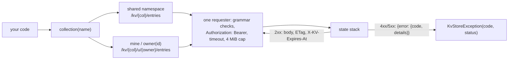

# yingyeothon_kvstore_client

A client for the yyt key-value store served by the state stack
(`https://doc.yyt.life/kv/*`): read a collection the team publishes, save and load a
player's own record, with the channel JWT the game already holds. Pure Dart, one
`http.Client`, no cache, no retry; it never logs, throws or returns a message that
contains the token, a key, a value or a URL.

Every call goes down one path: a segment is checked against the server's grammar, the
token goes in one header, and a refusal comes back as a status and a code:



## Install

```yaml
dependencies:
  yingyeothon_kvstore_client:
    git:
      url: https://github.com/yingyeothon/flutterlib.git
      path: packages/yingyeothon_kvstore_client
```

## Usage

```dart
import 'package:yingyeothon_kvstore_client/yingyeothon_kvstore_client.dart';

final kv = KvStoreClient(KvStoreClientOptions(
  baseUrl: Uri.parse('https://doc.yyt.life'),
  token: token.jwt, // from yingyeothon_auth_client
));

// (1) announcements: a console collection with readScope project, writeScope team.
final notices = await kv.collection('announcements').list(values: true, order: KvOrder.desc);
for (final entry in notices.entries) {
  print('${entry.key}: ${entry.value}');
}

// (2) my record: a console collection with readScope user, writeScope user.
final mine = kv.collection('profile').mine;
final saved = await mine.get('settings', orElse: () => null) as Map<String, Object?>?;
await mine.put('settings', {...?saved, 'volume': 0.5});

kv.close(); // closes the http.Client the library created; a later call is a `network` failure
```

Paging walks `nextCursor` until it is `null`:

```dart
String? cursor;
do {
  final page = await kv.collection('announcements').list(cursor: cursor, limit: 100);
  for (final entry in page.entries) {
    print(entry.key);
  }
  cursor = page.nextCursor;
} while (cursor != null);
```

`collection()` takes the console name or the `kv_` id and is pure: it builds paths and
holds no state. A value is any JSON value; it goes out through `jsonEncode` and comes
back decoded, so a `Map` reads with `yingyeothon_codec`'s `JsonReading` helpers.

## Absent versus stored `null`

A stored JSON `null` decodes to Dart `null`, so `get()` cannot use `null` for "no
such key". Two tiers:

- `getEntry(key)` returns `null` for a missing key and a `KvEntry` whose `value` may
  be `null` otherwise. A collection that does not exist in your project is the same
  `404`, so it reads as "missing key" too; `info()` is the call that tells them apart.
- `get(key)` returns the value; on a missing key it calls `orElse` when given and
  throws `KvStoreException(404, 'not_found')` otherwise. `orElse: () => null` is the
  "treat missing as null" idiom.

## Versions, conditions and TTL

- Every read carries the version (`KvEntry.version`, `KvListEntry.version`); every
  write returns it in `KvWriteResult.version` **unless the caller may not read the
  collection**, in which case `created` and `version` are `null` (`expiresAt` still
  comes back when that write set a `ttl`).
- `put(ifMatch: v)` writes only while the stored version is `v`; `put(ifNoneMatch:
  true)` only while the key is absent; `delete(ifMatch: v)` likewise. A lost
  compare-and-set is `KvStoreException` with `isVersionMismatch` (a `409` without a
  `reason`; `isConflict` is every `409`), `hasCurrentVersion` and `currentVersion`
  (`null` = the key is absent), the last two only for a reader.
- `ttl` is seconds, 1 s to 366 days; `0` clears the expiry, omitted keeps it.
  `expiresAt` is an absolute epoch second and is sent only when *that* write set it.
- `incr(key, delta)` is the server's atomic counter; it takes no conditions and needs
  the read right.

## Local refusals

Only what the server would refuse, thrown as `ArgumentError` before any request: the
key grammar, the collection name grammar, the owner grammar, a value over 16 KiB of
UTF-8, `ttl` and `limit` out of range, an `ifMatch` below 1 (there is no version 0;
create with `ifNoneMatch`), `ifMatch` with `ifNoneMatch`. The message
names the rule, never the input. The constants are in `KvRules`, cited to the server.

## Failures

`KvStoreException` for anything the server or the network refused: `isConflict`
(every 409), `isVersionMismatch` (a 409 without a `reason`), `isFull` (409 with
`reason` `collection_full` or `owner_full`), `isForbidden` (403), `isUnauthorized`
(401), `isNotFound` (404); `reason` also carries `not_a_number`, `overflow` and
`wrong_namespace`. `status` `0` with `code` `network` is a timeout or
a connection failure; `malformed_response` (with the answer's status) is a body or an
`ETag` the server promised and did not send, or a body over 4 MiB. `toString()` is
`KvStoreException(code, status)` and nothing else.

## Public API

- `KvStoreClient` (`collection`, `close`), `KvStoreClientOptions` (`baseUrl`,
  `token`, `client`, `logger`, `timeout`).
- `KvCollection` (`ref`, `info`, `mine`, `owner`), `KvNamespace` (`get`, `getEntry`,
  `put`, `delete`, `list`, `incr`).
- `KvCollectionInfo`, `KvEntry`, `KvWriteResult`, `KvListEntry`, `KvPage`,
  `KvIncrResult`, `KvOrder`, `KvScope` (`team`, `project`, `user` as strings).
- `KvStoreException` (`status`, `code`, `reason`, `currentVersion`,
  `hasCurrentVersion`, the `is…` predicates, and the parsers `fromResponse`,
  `parseEtagVersion`, `parseExpiresAt`), `KvRules` (the server's grammars and
  bounds, and the checks).

## Differences from @yingyeothon/kvstore-client and Yingyeothon.KvStore

- **Absent is `orElse`, not `undefined`.** tslib returns `undefined` from `get()` and
  csharplib tells C# `null` from `JsonValue.Null` apart; Dart has neither, so `get()`
  takes `orElse` and `getEntry()` is the null-returning tier.
- **`KvScope` is a set of string constants**, not an enum, so a scope the console
  adds later cannot become a parse failure (`CONVENTIONS.md`, open string sets).
- **The client owns an `http.Client`** when none is injected and `close()` closes
  it; tslib has no lifetime because `fetch` has none.
- **`KvListEntry.hasValue`** says whether the server sent a value, because a stored
  `null` and "no value requested" are both `null` in `value`.

## What this does not do

No collection administration (the console and `yyt kv` create collections), no cache
(every response is `Cache-Control: no-store`), no retry, no token refresh (a new token
is a new client), and no encryption (the server does it; `encrypted` is metadata).
