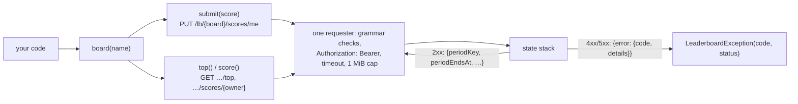

# yingyeothon_leaderboard_client

A client for yyt leaderboards served by the state stack (`https://doc.yyt.life/lb/*`,
the host that also serves the key-value store): submit a player's score and read a
ranked page, with the channel JWT the game already holds. Pure Dart, one
`http.Client`, no cache, no retry; it never logs, throws or returns a message that
contains the token, an owner, a `meta` or a URL.

Every call goes down one path: a segment is checked against the server's grammar, the
token goes in one header, and a refusal comes back as a status and a code:



## Install

```yaml
dependencies:
  yingyeothon_leaderboard_client:
    git:
      url: https://github.com/yingyeothon/flutterlib.git
      path: packages/yingyeothon_leaderboard_client
      ref: v0.1.0
```

## Usage

```dart
import 'package:yingyeothon_leaderboard_client/yingyeothon_leaderboard_client.dart';

final lb = LeaderboardClient(LeaderboardClientOptions(
  baseUrl: Uri.parse('https://doc.yyt.life'),
  token: token.jwt, // from yingyeothon_auth_client
));
final race = lb.board('weekly-race'); // a console board with submit: owner

// My run: one write to every bucket the board keeps, judged by its rule.
final result = await race.submit(1200, meta: '{"laps":3}');
for (final stored in result.periods) {
  print('${stored.bucket.period}: ${stored.score}'); // on a best board, what stayed
}

// The ranked page of the first period, and where I stand in it.
final page = await race.top(limit: 10);
for (final entry in page.entries) {
  print('#${entry.rank} ${entry.owner} ${entry.score}');
}
final mine = await race.score(); // null until I have a row
print('rank ${mine?.rank} of ${page.total}');

lb.close(); // closes the http.Client the library created
```

`board()` takes the console name or the `lb_` id and is pure: it builds paths and
holds no state. Every answer carries the bucket it is about (`LbBucket`: the
period, the key the platform computed in `Asia/Seoul`, and the second it ends), so
nothing is derived from the device's clock.

## Who may write

`LeaderboardInfo.submit` says: `server` is the auth channel's doc apiKey alone,
`owner` also admits a player writing its own row (`me`), and the apiKey may submit
on anyone's behalf either way — the only way to correct a row. Reads are open to
every credential of the project. `deleteScore` (every bucket at once) and
`clearPeriod` (one batch of the current bucket; call again while `truncated`) are
the apiKey's; a player gets `403`.

## Scores and `meta`

A score is a safe integer (`±(2^53 − 1)`); the board's `rule` decides what a new one
does to the stored one (`best` keeps the better by `order`, `latest` replaces, `sum`
adds and saturates). `meta` is JSON **text** of at most 1 KiB with no control
characters, stored byte for byte and never parsed — send a string, so an integer
past 2^53 survives; an accepted score without a `meta` clears the stored one, a
rejected score leaves it alone. A bucket at its cap refuses the **whole** write
(`409`, `isBoardFull`).

## Local refusals

Only what the server would refuse, thrown as `ArgumentError` before any request: the
board name or id grammar, the owner grammar (`me`, 32 hex, `kind:id`), a period
name outside `alltime`/`daily`/`weekly`, `limit` outside 1 … 100, `offset` outside
0 … 1000, a score outside the safe-integer range, a `meta` with a control character
or over 1 KiB. Whether the board keeps a period is the server's `400`. The message
names the rule, never the input. The constants are in `LbRules`, cited to the server.

## Failures

`LeaderboardException` for anything the server or the network refused: `isNotFound`
(404: no such board in the caller's project — a board of another project is the
same answer, on purpose — or no row for that owner; `score()` and `deleteScore()`
fold **both** into `null` and `false`, so a misspelt board reads as "no row yet"
until `info()` says otherwise), `isForbidden` (403), `isUnauthorized`
(401), `isBoardFull` (409 with `reason` `board_full`), `isBadRequest` (400: a period
the board does not keep, `me` from a server key); a `meta` over 1 KiB would be a
`413`, refused locally first. `status` `0` with `code` `network`
is a timeout or a connection failure; `malformed_response` is a body that is not
the promised JSON or over 1 MiB. `toString()` is `LeaderboardException(code,
status)` and nothing else.

## Public API

- `LeaderboardClient` (`board`, `close`), `LeaderboardClientOptions` (`baseUrl`,
  `token`, `client`, `logger`, `timeout`).
- `Leaderboard` (`ref`, `info`, `submit`, `top`, `score`, `deleteScore`,
  `clearPeriod`).
- `LeaderboardInfo`, `LbBucket`, `LbEntry`, `LbPage`, `LbScore`, `LbStoredScore`,
  `LbSubmitResult`, `LbClearResult`; the string sets `LbPeriod`, `LbSubmit`,
  `LbRule`, `LbOrder`.
- `LeaderboardException` (`status`, `code`, `reason`, the `is…` predicates,
  `fromResponse`), `LbRules` (the server's grammars and bounds, and the checks).

## Differences from @yingyeothon/leaderboard-client and Yingyeothon.Leaderboard

- Neither exists: tslib and csharplib have no leaderboard client as of 2026-10-01,
  so this package is ahead of both. The vocabulary (`board`, `submit`, `top`,
  `score`, `LbBucket`) follows the service's own (`docs/leaderboard.md` there) so a
  port keeps it.
- Follows `kvstore_client`'s shape on purpose — the same host, the same token, the
  same one-requester rule, the same exception shape — so a game that holds one
  holds both the same way.

## What this does not do

No board administration (the console and `yyt lb` create boards), no cache (every
answer is `Cache-Control: no-store`), no retry, no token refresh, and no past
buckets: the API names a period, never a bucket key, and the console is where a
retained past bucket is read.
