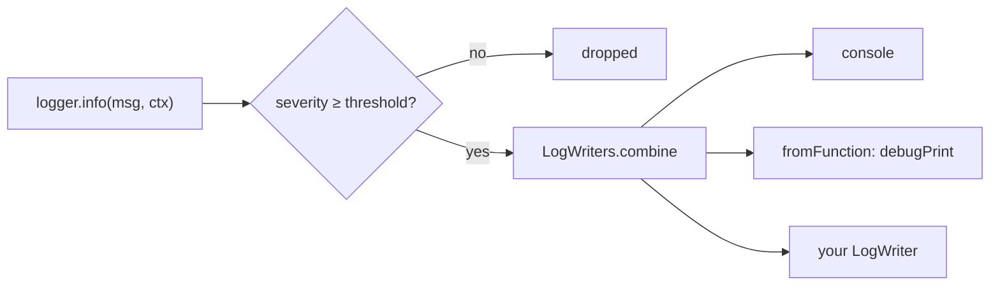

# yingyeothon_logger

A structured logger with a severity threshold that can change at runtime. Every yyt
package takes a `Logger` option and defaults to `nullLogger`; a structured context is
a `JsonObject`, so one writer renders every line the same way on every platform.

A line passes the threshold, then fans out to whatever writers you composed:



## Install

```yaml
dependencies:
  yingyeothon_logger:
    git:
      url: https://github.com/yingyeothon/flutterlib.git
      path: packages/yingyeothon_logger
```

## Usage

```dart
import 'package:yingyeothon_logger/yingyeothon_logger.dart';

final logger = createConsoleLogger(LogSeverity.info);
logger.info('lobby connected', {'channelId': id, 'zone': zone});
logger.severity = LogSeverity.debug; // read on every call; raise it to debug one session
```

In a Flutter app, route the SDK's lines through `debugPrint` with one line:

```dart
final logger = createFilteredLogger(
  severity: LogSeverity.info,
  writer: LogWriters.fromFunction((s, m, c) => debugPrint(LogWriters.format(s, m, c))),
);
```

`LogWriters.format` produces `[info] lobby connected {"channelId":"…"}` — deterministic,
so a test can assert a whole line.

## What the SDK logs

Ids, codes, counts and lengths. Never a token, a frame body, a payload, a close
reason's text or a URL that came off the wire — see the repository's
[security rules](../../rules/security.md). A writer you plug in may persist forever,
and `debug` is not an exemption.

## Public API

- `Logger`, `LogWriter`, `LogSeverity` (`debug`, `info`, `warn`, `error`, `none`).
- `LogWriters` (`console`, `none`, `fromFunction`, `combine`, `format`) and
  `LogWriteFunction`.
- `nullLogger`, `createFilteredLogger`, `createConsoleLogger`.

## Differences from @yingyeothon/logger and Yingyeothon.Logger

- Depends on `yingyeothon_codec` for the context type, like csharplib and unlike
  tslib: a `JsonObject` context renders without reflection.
- `LogWriters.combine` skips only the identity-known null writers (`LogWriters.none`,
  `nullLogger`); any other writer is kept even if it drops everything, because the
  combiner cannot know.
- No Slack or S3 writers: those are tslib server packages.
