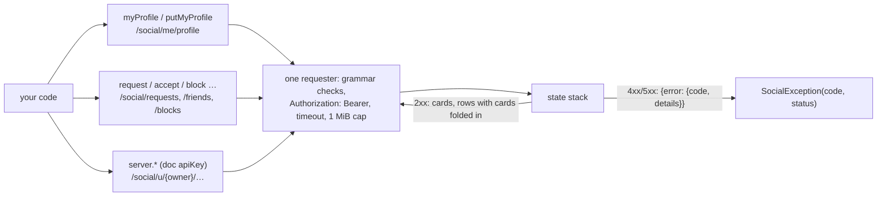

# yingyeothon_social_client

A client for yyt social served by the state stack (`https://doc.yyt.life/social/*`,
the host that also serves the key-value store): a player's card, friend requests,
friends and blocks within one auth channel, with the channel JWT the game already
holds. Pure Dart, one `http.Client`, no cache, no retry; it never logs, throws or
returns a message that contains the token, a player id, a display name or a URL.

Every call goes down one path: a segment is checked against the server's grammar, the
token goes in one header, and a refusal comes back as a status and a code:



## Install

```yaml
dependencies:
  yingyeothon_social_client:
    git:
      url: https://github.com/yingyeothon/flutterlib.git
      path: packages/yingyeothon_social_client
      ref: v0.1.0
```

## Usage

```dart
import 'package:yingyeothon_social_client/yingyeothon_social_client.dart';

final social = SocialClient(SocialClientOptions(
  baseUrl: Uri.parse('https://doc.yyt.life'),
  token: token.jwt, // from yingyeothon_auth_client
));

// A card admits me to the graph; every relation needs one at both ends.
await social.putMyProfile('Alice', avatar: 'heroes/mage');

// Ask a player id from the lobby roster; mutual requests settle at once.
final sent = await social.request(peerUserId);
print(sent.state); // requested, or friends

// What waits for me, and who my friends are, cards folded in.
for (final r in (await social.requests()).incoming) {
  await social.accept(r.owner);
}
for (final f in await social.friends()) {
  print('${f.owner} since ${f.since}'); // the name is their text: filter it first
}

social.close(); // closes the http.Client the library created
```

`social.server` is the doc apiKey's half: `friendsOf(player)`, `putProfile(owner,
…)` (a guild too, `kind:id`), `deleteProfile(owner)`, `deleteRelations(player,
other:)`. It reads anyone, writes cards and deletes relations, and never creates
one: a server that could make a friendship could forge consent.

## The graph, in short

One row per direction, four states: `requested` (in their inbox), `dropped` (they
declined; you see it as pending, and the slot stays spent for 30 days), `friends`
(two rows), `blocked` (one-directional, and the only state another player's write
leaves alone). `request` to somebody who already asked you makes you friends
without an accept. A block drops their request or your friendship, never their
block of you; an unblock restores a cooldown the block preserved, never a
friendship. `deleteMyProfile` takes your relations in both directions, except
somebody else's block of you. The guide has the rest:
[Friends and blocks](../../docs/social.md).

## Local refusals

Only what the server would refuse, thrown as `ArgumentError` before any request: a
player id that is not 32 hex (a relation's other end is always a player), a profile
owner outside `32 hex` or `kind:id`, a display name outside 1 … 32 characters after
trimming or carrying a control, format or line-separator character or a run of five
combining marks, an avatar that is not a short id or path (no `:`, no leading `/`,
at most 64 characters), no id or more than 50 for `profiles`. The message names the
rule, never the input. The constants are in `SocialRules`, cited to the server.

## Failures

`SocialException` for anything the server or the network refused: `isNotFound`
(404: no card, or on a relation write the target has no card, blocked you, or does
not exist — one answer for all three, on purpose; `myProfile()` and the two
`deleteProfile`s fold it into `null` / `false`, `accept` and the other transitions
throw it), `isForbidden` (403: a server key on a `me` route, a player on a server
route, a token whose subject is not a player id), `isUnauthorized` (401),
`isConflict` (409) with `isProfileRequired`, `isBlocked` and `isFull`
(`friends_full`, `peer_friends_full`, `pending_full`, `peer_pending_full`,
`blocks_full`, `channel_full`, in `reason`), `isBadRequest` (400: yourself).
`status` `0` with `code` `network` is a timeout or a connection failure;
`malformed_response` is a body that is not the promised JSON or over 1 MiB.
`toString()` is `SocialException(code, status)` and nothing else.

## Public API

- `SocialClient` (`myProfile`, `putMyProfile`, `deleteMyProfile`, `profiles`,
  `friends`, `requests`, `blocks`, `request`, `accept`, `decline`, `withdraw`,
  `unfriend`, `block`, `unblock`, `server`, `close`), `SocialClientOptions`
  (`baseUrl`, `token`, `client`, `logger`, `timeout`), `SocialServerCommands`
  (`friendsOf`, `putProfile`, `deleteProfile`, `deleteRelations`).
- `SocialProfile`, `SocialProfileResult`, `SocialRelation`, `SocialRequests`,
  `SocialRequestResult`; the string set `SocialRelationState`.
- `SocialException` (`status`, `code`, `reason`, the `is…` predicates,
  `fromResponse`), `SocialRules` (the server's grammars and caps, and the checks).

## Differences from @yingyeothon/social-client and Yingyeothon.Social

- Neither exists: tslib and csharplib have no social client as of 2026-10-01, so
  this package is ahead of both. The vocabulary (card, request, block, the four
  states) follows the service's own (`docs/social.md` there) so a port keeps it.
- Follows `kvstore_client`'s shape on purpose — the same host, the same token, the
  same one-requester rule, the same exception shape — so a game that holds one
  holds all three the same way.

## What this does not do

No presence (the gateway's `GET /presence` answers who is online; it is not
block-aware), no card search (`profiles` confirms ids you hold, never lists), no
cache, no retry, no token refresh.
